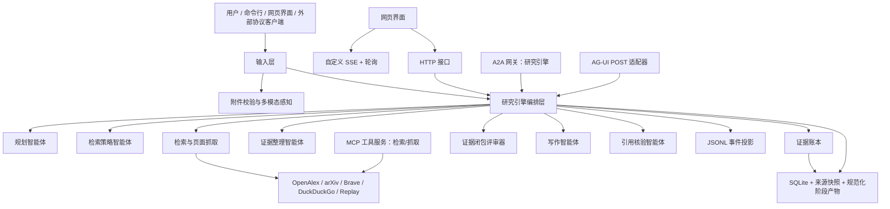

# 可验证智能深度调研系统：项目原理、实现细节与面试讲解手册

本文用于项目介绍、技术面试准备和源码回顾。内容依据当前仓库中的可执行实现、测试和运行记录整理。阅读顺序建议为：先掌握第 1 至第 4 节的项目主线，再结合第 5 至第 14 节理解具体实现，最后使用第 16 节进行模拟问答。

核心源码入口：

- 工作流编排：`src/deep_research/engine.py`
- 智能角色与引用契约：`src/deep_research/agents.py`
- 状态与数据模式：`src/deep_research/state.py`、`src/deep_research/schemas.py`
- 证据账本与闭包：`src/deep_research/evidence.py`
- 持久化、恢复与并发租约：`src/deep_research/storage.py`、`src/deep_research/resume.py`
- 模型、检索与抓取适配层：`src/deep_research/providers/`
- 多模态输入：`src/deep_research/multimodal.py`
- 网页服务与实时界面：`src/deep_research/webapp.py`、`web/`
- MCP、A2A、AG-UI 协议适配：`src/deep_research/protocols/`
- 自动化测试：`tests/`

### 阅读约定

本文正文采用中文技术表达。首次出现的核心概念按“中文名称（源码或协议名称）”标注，例如“证据记录（`Evidence`）”“证据闭包引擎（`ClosureEngine`）”。反引号中的英文用于定位源码、接口字段、命令和协议名称；面试讲解时直接使用前面的中文名称。协议缩写按职责理解：模型上下文协议（MCP）用于连接智能体与工具，智能体间协作协议（A2A）用于远程任务协作，智能体与用户界面交互协议（AG-UI）用于前端任务事件和状态同步。

## 1. 项目概览

### 1.1 一句话介绍

这是一个以“证据闭包”为交付门槛的智能深度调研系统。用户提交研究问题和可选附件后，系统将问题拆解为可验证的回答目标，执行多轮检索、页面抓取、证据抽取、反证搜索、写作和逐句引用核验，最终输出带可追溯证据链的研究答案。

### 1.2 项目解决的问题

通用大模型适合归纳、表达和生成检索策略，复杂事实问答仍需要工程机制保障以下能力：

1. 将一个自然语言问题拆成多个可以分别验证的原子目标。
2. 将网页正文中的原句与答案中的声明建立可审计绑定。
3. 识别转载、镜像和近重复页面，避免把同一稿源误计为多个独立来源。
4. 主动寻找反证或冲突信息，并将支持信息、反证信息和冲突信息一起纳入审计。
5. 在网络中断、模型超时、服务重启或用户取消后恢复到准确的执行位置。
6. 记录模型调用、费用、词元用量、来源快照、阶段产物和错误归因，支持复盘和评测。

项目的核心设计思想是：**模型产生结构化候选，程序以证据、来源、冲突和引用契约决定候选是否进入下一阶段。**

### 1.3 最适合介绍的业务场景

系统适合以下类型的问题：

- 学术论文、方法、数据集、基准和技术路线调研。
- 技术选型、版本演进、标准协议和官方文档核对。
- 需要“结论 + 引文 + 来源快照 + 调研过程”的研究型问答。
- 需要比较多个事实来源、处理日期或数值冲突的问题。
- 含图片、PDF、文本、JSON、CSV、音频等附件的技术问题分析。

默认搜索路径以 OpenAlex 和 arXiv 为主，适合学术与技术资料；Brave 可作为广义网页检索扩展；离线回放适配器（`Replay`）用于确定性的回归测试。

### 1.4 面试中建议使用的 90 秒版本

> 我做的是一个可验证的深度调研智能体系统。它的重点是把“模型直接生成答案”转化成“依据证据链交付答案”的过程。系统先将问题拆成回答槽位和子目标，再围绕当前证据缺口生成检索式，执行检索和页面抓取。证据整理智能体从网页正文中抽取结构化证据，每条证据包含事实性声明、逐字原文引文、来源、内容哈希和来源关系。随后证据闭包引擎逐项检查每个回答目标的来源独立性、原文定位、反证检索和冲突裁决。通过交付硬门后，写作智能体仅使用已准入的证据生成答案；引用核验智能体再逐句检查答案、引用编号和证据集合是否严格对应。整个流程使用 SQLite 保存检查点、外部操作账本、角色调用账本和来源快照，支持崩溃恢复、幂等结果回放和审计。默认模型团队中，GPT 负责感知、规划和写作，DeepSeek 负责查询策略和证据整理，Qwen 负责独立引用核验，本地规则负责最终证据门控。

## 2. 总体架构

### 2.1 分层架构



系统由五层组成：

| 层级 | 主要模块 | 职责 |
|---|---|---|
| 接入层 | 命令行、网页接口、MCP、A2A、AG-UI | 接收任务、附件、恢复请求和外部协议消息 |
| 编排层 | `ResearchEngine` | 驱动状态机、预算、恢复、错误路由和阶段交接 |
| 智能体层 | 规划、检索策略、证据整理、闭包评审、写作、引用核验 | 将模型能力拆分为职责明确的结构化步骤 |
| 工具层 | 检索适配器、网页抓取、PDF 解析、多模态处理 | 获取外部资料、解析页面、处理附件 |
| 证据与持久化层 | 证据账本、证据闭包引擎、运行存储器 | 保存来源、证据、快照、操作、账本、事件与最终结果 |

### 2.2 为什么采用显式状态机

研究引擎（`ResearchEngine`）使用手写的异步状态机。每个阶段都由研究状态（`ResearchState.next_node`）指定后继节点，典型节点包括：

```text
附件感知（perceive_inputs）
  -> 研究规划（plan）
  -> 生成检索式（generate_queries）
  -> 检索与抓取（search_and_fetch）
  -> 证据入库（ingest_evidence）
  -> 证据闭包评审（assess_closure）
  -> 撰写草稿（draft）
  -> 引用核验（verify）
  -> 最终交付（finalize）
  -> 结束（done）
```

这种结构将流程控制从提示词（Prompt）中提取出来，由程序保证以下性质：

- 每个节点的输入和输出可序列化。
- 每个阶段完成后产生检查点（`checkpoint`）。
- 证据更新会使旧草稿和旧核验结果失效，随后重新执行闭包、写作和验证。
- 预算耗尽、引用失败、用户取消、模型不确定结果都能转化为明确的状态和恢复入口。
- 运行过程可以在网页界面、HTTP 接口、HTML 报告和 SQLite 审计中使用同一份状态解释。

### 2.3 关键术语

| 术语 | 含义 | 持久化位置 |
|---|---|---|
| 任务运行（`Run`） | 一次完整研究任务，以 `run_id` 标识 | `runs/<run_id>/` |
| 研究状态（`ResearchState`） | 当前工作流状态，包括节点游标、计划、查询、页面、证据和草稿 | 检查点 SQLite |
| 外部操作（`Operation`） | 一次模型调用、检索或抓取操作 | SQLite 外部操作账本 |
| 角色调用（`Invocation`） | 一次角色执行记录，包含输入摘要、模型、耗时、状态和交接消费信息 | SQLite 调用账本 |
| 来源记录（`SourceRecord`） | 检索到的候选来源及其抓取、来源关系和快照状态 | 检查点 / 来源抓取账本 |
| 证据记录（`Evidence`） | 支持或反驳一个回答目标的结构化证据 | 检查点 / 证据账本 |
| 阶段产物（`Artifact`） | 阶段输出的规范化 JSON 产物，带 SHA-256 和父产物关系 | `artifacts/` + SQLite |
| 阶段交接（`Handoff`） | 阶段间交接信封，声明路由、产物和质量门 | 交接消息表 |
| 消费回执（`Receipt`） | 后续智能体已消费某个阶段交接的持久化回执 | 交接消费账本 |
| 执行世代号（`Fence`） | 运行执行权的单调递增编号，用于隔离过期工作线程 | 执行租约账本 |

## 3. 一次任务的端到端执行过程

### 3.1 输入接收与运行初始化

用户可以通过命令行、网页、A2A 或 AG-UI 发起任务。网页服务创建任务运行后，将问题、模型配置档和附件信息写入持久化目录。`ResearchEngine.run(question, run_id)` 会执行以下初始化：

1. 根据 `run_id` 打开对应的 `RunStore`。
2. 读取最近检查点；首次执行时创建新的研究状态（`ResearchState`）。
3. 读取附件清单，校验检查点中的附件身份与持久化清单一致。
4. 固化本次任务的预算上限和总上限。
5. 写入方法学快照，包括模型路由、检索适配器、闭包规则版本和多模态契约。
6. 合并已保存的角色调用、用量、操作结果和恢复信息。
7. 根据 `next_node` 从精确的后继节点继续执行。

`run_id` 与问题绑定。恢复请求携带不同问题时，系统会阻止状态混用。

### 3.2 多模态感知阶段

当请求带有附件时，状态机从附件感知节点（`perceive_inputs`）开始。每个附件拥有独立的感知操作键，因此单个附件的处理结果可以单独回放。

输入处理流程如下：

1. 校验文件数量、单文件大小和总大小。
2. 使用魔数识别 PNG、JPEG、GIF、WebP、PDF、WAV、MP3、Ogg、FLAC、WebM、MP4 等二进制格式。
3. 将文件名规整为安全的基础名称（`basename`）。
4. 为原始字节计算 SHA-256，写入私有内容寻址路径和附件清单（`manifest`）。
5. 文本、JSON、CSV、Markdown 在本地提取文本；PDF 通过 `pdftotext` 提取文本，并可使用 `pdftoppm` 渲染前几页作为图像感知输入。
6. 图像通过兼容 OpenAI 的 `image_url` 消息部分传入模型；音频通过 `input_audio` 消息部分传入已声明支持该模态的模型。
7. 感知智能体（`Perception`）输出带定位信息的观察，例如 PDF 页码、图像区域或音频时间段。

附件观察进入证据链时，需要匹配已保存的观察文本，并携带定位信息、感知模型和证据定位信号（`grounding signal`）。附件材料参与回答上下文和证据账本；来源独立性仍然由外部来源簇规则统一计算。

### 3.3 研究规划阶段

规划智能体（`Planner`）接收原始问题和附件观察摘要，输出研究计划（`ResearchPlan`）：

```python
@dataclass
class ResearchPlan:
    answer_type: str
    slots: list[AnswerSlot]
    subgoals: list[Subgoal]
```

其中：

- 回答槽位（`AnswerSlot`）表示最终答案中必须覆盖的原子目标，例如“创建者”“首次发布时间”“关键技术路线”。
- 子目标（`Subgoal`）表示完成该回答槽位所需的可检索问题，并关联到一个或多个回答槽位。
- `done_when` 描述完成条件，供后续智能体和证据闭包引擎解释任务状态。

例如问题“Python 由谁创建，首次发布于哪一年”可以拆成两个必需回答槽位：

| 回答槽位 | 目标 | 示例证据要求 |
|---|---|---|
| `creator` | 确认创建者 | 官方资料或权威资料的逐字原文 |
| `first_release` | 确认首次发布时间 | 包含年份的可定位来源和反证检查 |

原子化设计让系统可以准确表达“创建者已确认，发布时间仍缺独立来源”这一状态，避免用一段模糊的整体置信描述替代具体问题。

### 3.4 缺口驱动的查询生成

检索策略智能体（`Scout`）接收以下输入：

- 原始问题。
- 研究计划（`ResearchPlan`）。
- 当前证据闭包引擎给出的证据缺口（`EvidenceGap`）列表。
- 历史查询。
- 已识别的支持、冲突、重复和失败信息。

查询策略包括：

| 查询类型 | 作用 | 示例 |
|---|---|---|
| 宽泛发现 | 第一轮寻找候选实体和术语 | `Python history creator first release` |
| 实体消歧 | 消除同名、时间和机构歧义 | `Python Guido van Rossum first release 1991` |
| 来源定向 | 为特定缺口寻找指定来源类型 | `site:docs.python.org Python first released` |
| 反证检索 | 主动查询相反年份、勘误或版本差异 | `Python first release date 1990 1991 history` |
| 恢复检索 | 网络失败、来源不足或引用失败后的定向补检索 | `official archive Python release 1991` |

系统对查询进行规范化和近重复控制：

1. 规整大小写、空白和标点。
2. 计算词元重叠与相似度。
3. 在同一回答意图下过滤语义近似查询。
4. 保留用于不同缺口的替代检索视角，例如“补独立来源”和“寻找反证”使用不同检索式。
5. 当模型给出的检索式不足以覆盖必需子目标时，编排器补充目标覆盖检索式。

这种机制让后续每一轮检索围绕明确的缺口执行，检索范围始终由待补证目标定义。

### 3.5 搜索、选择与抓取

检索与抓取节点（`search_and_fetch`）将检索和抓取拆为两类外部操作：

1. 对当前检索式批次并发调用检索适配器的 `SearchProvider.search`。
2. 将候选 URL 规范化，去除重复 URL 和追踪参数。
3. 按检索式轮询选择结果，让不同子目标共享页面预算。
4. 对入选结果并发调用 `SearchProvider.fetch`。
5. 为成功抓取页面保存来源快照、抓取记录、内容哈希和来源关系信息。

每次搜索操作使用 `asyncio.gather` 执行批处理并发。并发数量由当前任务剩余搜索次数、页面数和预算控制。默认初始预算为：

| 指标 | 初始上限 | 总上限 |
|---|---:|---:|
| 迭代次数 | 3 | 9 |
| 搜索调用 | 8 | 24 |
| 选择页面 | 12 | 36 |

证据闭包仍存在关键缺口时，系统可以申请有界的恢复额度，并将扩展原因、额度和结果持久化。这样既支持复杂问题的定向补证，也能保证成本与时延具有可解释的上限。

### 3.6 证据抽取与证据账本

证据整理智能体（`Curator`）接收研究计划（`ResearchPlan`）和抓取页面，输出证据记录（`Evidence`）列表。核心数据结构包括：

```python
@dataclass
class Evidence:
    id: str
    subgoal_id: str
    slot_id: str
    claim: str
    quote: str
    source_url: str
    source_title: str
    stance: Literal["supports", "contradicts", "context"]
    reliability: float
    extraction_confidence: float
    content_hash: str
    source_cluster_id: str
    origin_cluster_id: str
    fetch_record_id: str
    snapshot_sha256: str
```

每条证据记录的关键含义如下：

- `claim`：准备支持的事实性声明。
- `quote`：来自页面正文的逐字引文。
- `stance`：支持、反驳或背景。
- `slot_id`：该证据服务的回答目标。
- `source_cluster_id` 与 `origin_cluster_id`：来源独立性计算的基础。
- `fetch_record_id`、`snapshot_sha256`：该证据所依赖的精确抓取版本和不可变快照。

证据账本在合并证据时处理重复项，并在全量证据集合上重新计算确定性标注。证据更新会增加 `evidence_revision`，从而使之前基于旧证据写出的草稿和核验结果自动失效。

### 3.7 证据闭包与路由决策

闭包评审智能体（`Critic`）由本地确定性规则实现。它调用 `ClosureEngine.evaluate(plan, evidence, contradiction_checked_slots)`，为每个必需回答槽位生成槽位审计记录（`SlotGateAudit`），并输出：

- `closed`：所有必需回答槽位是否完成闭包。
- `gaps`：具体缺口，例如独立来源不足、原文不充分、反证搜索状态缺失、抓取链状态缺失或冲突待裁决。
- `slot_audits`：每个回答槽位的支持证据、反驳证据、来源簇、门状态和失败原因。
- `score`：可解释的证据充分度诊断分数。

状态机根据结果路由：

```text
证据闭包硬门通过          -> 撰写草稿（draft）
证据闭包存在缺口          -> 生成检索式（generate_queries）
预算达到总上限            -> 证据不足（evidence_incomplete）-> 最终交付（finalize）
```

### 3.8 写作与逐句引用验证

写作智能体（Writer）只接收证据闭包引擎准入的支持证据。答案使用 `[E123]` 形式的证据编号引用。

引用核验智能体（`Verifier`）随后执行两层验证：

1. 模型层：对每个事实句给出“已蕴含（`entailed`）”“部分支持（`partial`）”或“缺少支持（`unsupported`）”，并返回证据编号集合。
2. 引擎层：使用 `parse_answer_claims` 解析最终答案中的事实句和引用；检查每个句子是否存在、引用是否属于准入证据、核验智能体是否覆盖了同一条句子、双方引用集合是否完全相等。

验证失败时，系统将失败声明转化为“缺少支持的声明”（`unsupported_claim`）缺口，进入下一轮定向检索。默认执行一轮引用修复，修复轮数和预算由状态持久化控制。

语义核验服务暂时不可用时，系统会生成本地引用绑定报告（citation-binding report），检查答案引用、可用证据和保存材料之间的绑定关系。运行记录会明确标识该交付模式，界面据此展示语义核验可用性。

### 3.9 最终交付、暂停与恢复

最终阶段统一处理以下状态：

| 状态 | 用户可见结果 | 恢复入口 |
|---|---|---|
| 已完成（`completed`） | 已生成研究答案和审计数据 | 已完成任务可查看和导出 |
| 证据不足（`evidence_incomplete`） | 基于现有材料的有边界交付、缺口和恢复建议 | `generate_queries` |
| 引用核验失败（`verification_failed`） | 已写答案的引用失败项和补证方向 | `generate_queries` |
| 已取消（`cancelled`） | 已保存的进度和取消位置 | 当前节点 |
| 执行失败（`failed`） | 错误分类、恢复策略和日志 | 分类决定的后继节点 |
| 操作结果待确认（`ambiguous_operation`） | 外部模型调用结果待确认 | 用户确认后恢复 |

所有状态都会生成面向人的终端说明，同时保留结构化暂停信息（`suspension`），用于网页界面、AG-UI 中断事件和命令行恢复。

## 4. 多智能体协作设计

### 4.1 六个角色的职责

| 角色 | 运行时标识 | 默认模型路由 | 输入 | 输出 | 质量控制 |
|---|---|---|---|---|---|
| 感知智能体（`Perception`） | `multimodal_perception` | GPT | 内容寻址附件 | 带定位观察 | SHA-256 附件清单、MIME 类型、定位信息、证据定位信号 |
| 规划智能体（`Planner`） | `research_planner` | GPT | 问题、附件上下文 | 回答槽位、子目标、完成条件 | 结构化计划校验 |
| 检索策略智能体（`Scout`） | `retrieval_strategist` | DeepSeek | 证据缺口、历史检索式、计划 | 检索式批次 | 查询去重、目标覆盖、预算 |
| 证据整理智能体（`Curator`） | `evidence_curator` | DeepSeek | 页面正文、计划 | 证据记录批次 | 引文定位、一致性、相关性、来源绑定 |
| 闭包评审智能体（`Critic`） | `evidence_critic` | 本地规则 | 证据账本 | 闭包报告（`ClosureReport`） | 每个必需回答槽位的硬门 |
| 写作智能体（`Writer`） | `evidence_writer` | GPT | 闭包准入证据 | 带引用答案 | 证据白名单 |
| 引用核验智能体（`Verifier`） | `citation_verifier` | Qwen | 答案、准入证据 | 核验报告（`VerificationReport`） | 声明和引用集合严格契约 |

感知智能体位于六角色链路之前，用于把附件转化为可定位观察。闭包评审智能体完全由本地确定性规则执行，负责闭包门控。

### 4.2 模型团队路由

默认模型团队配置档（`team`）的路由位于 `config.py`：

```python
DEFAULT_TEAM_ROUTES = {
    "perception": "gpt",
    "planner": "gpt",
    "scout": "deepseek",
    "curator": "deepseek",
    "writer": "gpt",
    "verifier": "qwen",
}
```

路由设计对应不同阶段的工作特点：

- 规划和写作需要较强的结构组织能力，以及图像和 PDF 感知能力。
- 查询策略和证据整理需要较低成本的多轮结构化调用。
- 引用核验由独立模型执行，形成写作与验收的角色分离。
- 关键交付门由本地规则执行，保证模型配置变化后仍保持稳定的结构性约束。

系统同时提供 `qwen`、`gpt`、`deepseek` 单模型配置档，用于横向比较模型能力与成本。每次角色调用都会保存模型提供方、选择别名、精确模型 ID、输入模态、调用次数、时间和使用量。

### 4.3 为什么角色间要保存阶段交接和消费回执

内部交接使用 `deep-research-handoff/1.1`。阶段交接信封（`Handoff Envelope`）包含：

- 生产者和目标消费者。
- 当前工作流节点。
- 规范化 JSON 阶段产物。
- 阶段产物的 SHA-256、内容地址、字节数、父产物。
- 阶段质量门结果。
- 幂等键。
- 运行 ID、追踪 ID、尝试次数和执行世代号。

后续智能体处理该内容时，会保存阶段交接消费回执（`HandoffReceipt`），其中记录原始 `message_id`、消费调用 ID、消费者、消费时间和外部操作。这样可以在审计界面中区分“编排器计划把产物交给谁”和“哪一次实际执行消费了该产物”。

## 5. 证据系统详解

### 5.1 证据记录的准入过程

证据整理智能体返回候选证据记录后，引擎执行以下检查：

1. **原文定位**：逐字引文（`quote`）必须可以在抓取正文或附件观察中精确定位。
2. **声明与引文一致性**：数字、年份、否定极性、英文词项或中文二元组覆盖均参与检查。
3. **目标相关性**：事实性声明、来源标题、检索路由与回答槽位/子目标的核心概念进行匹配。
4. **抓取来源绑定**：证据记录绑定准确的 `fetch_record_id`、快照 SHA-256、内容哈希范围和服务端绑定状态。
5. **多模态定位**：附件类证据进一步检查观察记录、定位信息、感知模型和落地信号。

声明与引文一致性算法（`claim_quote_consistency`）属于可审计的词法一致性检查：

- 先判断中英文书写体系是否匹配。
- 提取事实性声明中的数值，要求全部出现在逐字引文中。
- 检查正负语义中的否定词极性。
- 英文文本使用词元覆盖率；中文文本使用相邻字符二元组覆盖率。
- 当前最低阈值为 `0.6`。

这一层用于筛掉扩写、时间偷换、主题漂移和数字增补。最终句级语义蕴含由引用核验智能体再次执行。

### 5.2 来源去重与独立性

来源独立性以来源簇标识（`origin_cluster_id`）为统计单位。系统按以下顺序构建来源关系：

1. URL 规范化：去除片段、UTM 等跟踪参数，保留可访问的规范 URL。
2. 正文归一化哈希：识别正文完全相同的页面。
3. SimHash：识别近重复、转载和轻度改写页面。
4. 页面来源元数据：解析 `rel=canonical`、Schema.org/JSON-LD 的发布方和作者、OpenGraph 站点名、`citation`、`isBasedOn` 和上游 URL。
5. 发布方身份：使用发布方名称和 URL 构建发布方标识。
6. 可注册域：作为来源聚类的兜底信号。

来源记录（`SourceRecord`）保存独立性状态（`independence_status`）与原因（`independence_reason`）。常见状态包括：

| 状态 | 含义 | 计数方式 |
|---|---|---|
| 独立（`independent`） | 已形成独立来源簇 | 计入独立来源数 |
| 依赖（`dependent`） | 已识别为相同来源、转载或上游依赖 | 不增加独立来源数 |
| 声明发布方（`declared_publisher`） | 页面声明发布方信息 | 供人工审计与保守聚合 |
| 声明上游（`declared_upstream`） | 页面声明上游来源 | 供依赖关系判断 |
| 域名兜底聚类（`weak_host_fallback`） | 基于域名的弱聚类 | 在界面显示依据 |
| 待识别（`unknown`） | 来源关系尚缺充分信息 | 保留审计状态 |

系统通过这个过程防止多个新闻转载、镜像页面或同一组织多站点把独立来源数量抬高。

### 5.3 来源等级与证据充分度

当前来源类型先验如下：

| 来源类型 | 初始等级 |
|---|---:|
| 官方候选（`official`） | 0.95 |
| 学术论文（`paper`） | 0.90 |
| 参考资料（`reference`） | 0.82 |
| 一般网页（`web`） | 0.65 |

来源等级服务于排序、来源选择和闭包诊断。证据闭包的整体分数为：

```text
证据充分度分数 =
    0.35 × 必需回答槽位覆盖率
  + 0.25 × 来源独立性
  + 0.20 × 证据蕴含与落地程度
  + 0.10 × 来源等级
  + 0.10 × 冲突解决状态
```

分数用于展示当前证据状态、帮助检索策略智能体决定下一轮检索方向。写作放行由逐槽位硬门控制，确保每个必需回答槽位都拥有完整证据链。

### 5.4 每个槽位的硬门

一个必需回答槽位需要通过以下审计项：

| 硬门 | 计算依据 |
|---|---|
| 支持证据门 | 至少有与该回答槽位相关的支持证据 |
| 来源门 | 满足所需独立来源簇数量，或满足已验证的权威来源例外条件 |
| 原文与定位门 | 抽取置信度、声明-引文一致性、槽位相关性、附件定位均达标 |
| 抓取来源门 | 来源抓取、服务端绑定、快照 SHA-256、内容哈希范围完整 |
| 反证检查门 | 对该回答槽位已执行并检查相关反证检索结果 |
| 冲突门 | 当前候选值已形成可解释共识，或冲突已显式裁决 |

槽位审计记录（`SlotGateAudit`）会保存支持/反驳证据编号、独立来源簇、候选值、门状态、排除的证据和人类可读失败原因。前端通过它展示“哪一个回答槽位还缺什么”。

### 5.5 冲突处理

系统将支持证据（`supports`）与反驳证据（`contradicts`）分开存储，对数值、年份和人物身份类问题建立候选组：

1. 按候选数字、年份或身份签名聚类。
2. 去除来源依赖证据对独立票数的重复贡献。
3. 按独立来源数和来源等级排序。
4. 领先候选拥有足够独立来源且优于竞争候选时，形成已裁决共识。
5. 所有竞争候选和被排除证据都保留在槽位审计记录中。

例如“开发始于 1989”和“首次发布于 1991”属于不同事实维度。规划智能体的回答槽位描述和目标类型帮助系统将它们区分为开发时间与发布日期，避免把互补信息错误归为矛盾。

### 5.6 反证搜索

每个必需回答槽位都需要完成反证检查。检索策略智能体会为当前候选生成目标化反证检索式；系统将检索成功、页面抓取成功、页面相关性检查和反证证据抽取写入反证审计记录（`ContradictionAudit`）。

`ContradictionAudit` 记录：

- 回答槽位编号与检索式文本。
- 执行时间。
- 搜索结果数。
- 已检查页面数和相关页面数。
- 发现的反证。
- 已检查和被排除的来源编号。
- 错误信息与恢复状态。

这一设计将检索式、页面检查和反证结果完整保存在审计链中，研究者可以回溯“当前未发现反证”的形成过程。

## 6. 检索与页面抓取

### 6.1 检索适配器抽象

核心接口定义在 `providers/base.py`：

```python
class SearchProvider(Protocol):
    async def search(self, query: Query, limit: int = 5) -> list[SearchResult]: ...
    async def fetch(self, result: SearchResult) -> Page: ...
```

这种接口将工作流与具体检索供应商解耦。当前支持：

| 检索适配器 | 主要用途 | 关键特性 |
|---|---|---|
| OpenAlex | 学术资料发现 | 免 API 密钥，优先返回开放获取落地页、仓储、PDF 或 DOI 解析服务 |
| arXiv 回退 | OpenAlex 无结果或不可用时的学术回退 | 使用官方 Atom 接口 |
| Brave | 广义网页发现 | API 密钥仅放入请求头 |
| DuckDuckGo | 开发环境的免密钥检索 | 挑战页会触发明确的回退逻辑 |
| 回放适配器（`Replay`） | 离线回归和实验复现 | 本地 JSON 资料库，输出稳定 |

### 6.2 页面抓取产物

页面记录（`Page`）保存如下信息：

```python
@dataclass
class Page:
    url: str
    title: str
    text: str
    source_type: str
    content_hash: str
    fetched_at: str
    http_status: int | None
    content_type: str
    parser_version: str
    canonical_url: str
    publisher_name: str
    upstream_urls: list[str]
    fetch_record_id: str
    snapshot_sha256: str
```

抓取成功后，引擎执行以下持久化链路：

```text
检索结果（SearchResult）
  -> 来源记录（SourceRecord）
  -> 抓取操作
  -> 页面记录（Page）
  -> 不可变来源快照
  -> 来源抓取记录
  -> 证据记录中的 fetch_record_id / snapshot_sha256
```

页面正文会保存到私有来源快照。前端可以打开快照并高亮某条证据使用的逐字引文，从而实现“答案句子 -> 证据记录 -> 原始页面文本”的追溯。

### 6.3 安全抓取策略

外部 URL 进入网络请求前，抓取器执行以下安全流程：

1. 只允许 `http` 和 `https`。
2. 拒绝 URL 凭据、回环地址、私网地址、链路本地地址、元数据地址和异常端口。
3. 解析域名到公共 IP 地址。
4. 将已校验 IP 绑定到实际套接字连接，防止 DNS 重绑定。
5. 每一次重定向重新执行 URL 校验和地址绑定。
6. 对带 API 凭据的 Brave 检索使用无重定向策略。
7. 对响应体、PDF 输入、PDF 输出、解析时间和子进程资源设置限制。

PDF 提取使用受控 `pdftotext` 子进程；PDF 可视化使用受控 `pdftoppm` 子进程。附件和网页的解析资源限制由独立异常 `ResourceLimitExceededError` 表达，编排器据此给出针对性恢复策略。

## 7. 持久化、幂等与恢复

### 7.1 单个任务运行的目录结构

一个任务运行的典型目录结构：

```text
runs/<run_id>/
  checkpoints.sqlite       # 检查点、外部操作、用量、阶段交接等账本
  events.jsonl             # 面向实时展示的事件投影
  final.json               # 最终状态快照
  artifacts/               # 规范化阶段产物与元数据
  sources/                 # 不可变页面文本快照
  inputs/                  # 内容寻址附件与附件清单
```

目录和敏感文件以私有权限创建。运行目录与任务运行 ID 绑定，`validate_run_id` 限制 ID 格式，阻止路径穿越。

### 7.2 SQLite 中的主要账本

`RunStore` 将关键数据写入 SQLite。主要账本包括：

| 账本 | 保存内容 | 作用 |
|---|---|---|
| 检查点 | 每个节点完成后的完整研究状态 | 精确恢复工作流游标 |
| 外部操作 | 模型、检索、抓取操作的输入哈希、状态、结果和尝试次数 | 幂等与回放 |
| 角色调用 | 角色执行记录、模型路由、输入输出摘要、耗时、状态 | 可观测性与归因 |
| 阶段交接消息 | 阶段交接信封 | 追踪产物路由 |
| 阶段交接消费 | 后续角色调用的消费回执 | 证明实际消费关系 |
| 事件发件箱 | 与检查点同事务提交的事件 | 可靠投影到 JSONL |
| 来源抓取账本 | 请求 URL、最终 URL、抓取版本、快照和绑定状态 | 来源溯源 |
| 用量账本 | 词元用量、费用、缓存和定价状态 | 成本审计 |
| 执行租约 | 所有者令牌、执行世代号、过期时间和心跳 | 工作线程并发控制 |
| 恢复回执 | 暂停、用户确认和恢复授权 | 恢复流程治理 |

### 7.3 外部操作级幂等

每个外部操作拥有语义输入哈希和操作键。引擎执行模型操作的逻辑可以概括为：

```text
检查是否存在已完成的同一外部操作
  -> 存在：回放结果，记录回放调用
  -> 不存在：创建“已开始”外部操作
       -> 执行外部调用
       -> 先持久化结果与用量
       -> 再更新研究状态并写入检查点
```

这处理了一个常见崩溃窗口：外部模型已经成功返回，进程在写检查点前终止。下一次恢复会从外部操作账本回放已保存结果，调用次数和费用也能保持准确。

模型调用结果存在不确定性时，系统使用 `ProviderOutcomeUncertain` 标记该外部操作。典型情况包括请求发送后连接中断、响应体读取中断、HTTP 200 但 JSON 无法解析、已付费响应的缓存写入失败。该状态进入明确的人工确认恢复流程，避免对已产生费用的调用进行盲目重复。

检索和抓取通常属于幂等 GET 类操作。引擎可以记录物理尝试次数并按恢复策略继续执行，同时保持同一语义外部操作的审计关联。

### 7.4 检查点与 JSONL 事件日志

检查点与发件箱事件表中的记录在同一 SQLite 事务内提交。事件发布器随后将发件箱中的事件写入 `events.jsonl`：

1. 写入前扫描完整的 JSONL 记录，识别已经发布的事件 ID。
2. 进程异常终止留下的不完整尾行会被截断。
3. 缺失事件从发件箱事件表补写。
4. 写入后执行缓冲区刷新和 `fsync`。
5. SQLite 将该事件标记为已发布。

JSONL 事件日志用于实时界面展示和人工排查；SQLite 中的账本是恢复与审计的权威数据来源。

### 7.5 执行租约与执行世代号

网页后台工作线程为每个任务运行申请一份执行租约。取得执行权时会获得：

- 随机生成的执行者令牌。
- 单调递增的执行世代号（`fence`）。
- 15 秒有效期（TTL）。
- 每 5 秒一次的续租心跳。

检查点、发件箱事件、外部操作、用量、最终结果、来源快照和阶段产物写入 SQLite 时，都会在同一写事务中校验执行者令牌与执行世代号。新工作线程接管租约后，旧线程的迟到写入不再具备提交资格；外部调用期间租约失效时，引擎会结束该调用并终止后续写入。

同机文件锁 `fcntl` 提供第二层保护。这套机制适用于本地单机和单节点服务，能够清晰界定并发执行、接管和恢复时的写入归属。

### 7.6 任务恢复流程

恢复流程由 `resume.py` 与 `RunStore` 协作完成：

1. 读取最近一次检查点和暂停信息。
2. 校验恢复请求、预算扩展请求和付费操作确认状态。
3. 创建恢复回执。
4. 申请新的执行租约和执行世代号。
5. 生成定向恢复阶段交接消息。
6. 从 `resume_node` 指向的后继节点继续执行。

常见恢复位置：

| 触发原因 | 恢复节点 |
|---|---|
| 证据不足 | `generate_queries` |
| 引用核验失败 | `generate_queries` |
| 抓取失败 | `search_and_fetch` 或检索式恢复 |
| 规划失败 | `plan` |
| 用户取消 | 当前执行节点 |
| 外部模型结果不确定 | 用户确认后的原外部操作 |

## 8. 模型适配与成本记录

### 8.1 兼容 OpenAI 接口的模型适配器

在线模型调用集中在 `providers/deepseek.py` 的 `OpenAICompatibleModelProvider`。它承担不同模型服务之间的接口统一，支持：

- 共享的兼容 OpenAI 接口网关。
- GPT、Qwen、DeepSeek 的精确模型标识（`model ID`）。
- JSON 输出模式和结构化 JSON 解析。
- 从 Markdown 代码块中提取 JSON，并执行结构修复。
- 图像 `image_url`、音频 `input_audio`、文档文本等多模态请求内容。
- 原始响应缓存。
- 词元（Token）用量解析与费用估算。
- 模型请求幂等键（`idempotency key`）。
- HTTPS 源站校验、响应体大小限制和超时控制。

模型配置由 `.env` 与 `config/model-pricing.json` 驱动。定价按网关中的精确模型标识匹配，区分输入、缓存输入、输出和长上下文价格。定价数据缺失时，用量账本会保留成本状态，界面和报告可以据此区分已测量成本、部分估算成本和待配置价格。

### 8.2 智能角色调用记录

每次智能角色调用（`invocation`）记录以下字段：

```text
invocation_id
agent_id / role / operation
attempt / started_at / ended_at / status
execution_mode: executed | replayed
provider_call_count
model_provider / model_choice / model_id
input_modalities
input_summary / output_summary
consumed_handoff_message_ids
output_artifact_ids
quality_gate_statuses
side_effect_status
```

这些记录可以直接回答面试中的典型问题：哪个模型完成了哪个阶段、结果来自真实调用还是回放、是否命中缓存、是否产生费用，以及后续角色消费了哪些产物。

## 9. 网页服务与用户界面

### 9.1 服务实现

网页服务位于 `webapp.py`，使用 Python 标准库 `BaseHTTPRequestHandler`。服务默认绑定 `127.0.0.1:8000`，并对 API 请求执行主机名（Host）和来源（Origin）校验。

核心 API：

| 接口路径 | 方法 | 作用 |
|---|---|---|
| `/api/config` | GET | 返回安全的模型、搜索和配置档摘要 |
| `/api/methodology` | GET | 返回闭包算法、指标和版本说明 |
| `/api/system-contract` | GET | 返回协议适配运行状态与验证证据 |
| `/api/runs` | GET | 列出任务运行历史 |
| `/api/runs` | POST | 创建带问题、配置档和附件的新任务运行 |
| `/api/runs/{id}` | GET | 查询任务运行的当前状态和审计视图 |
| `/api/runs/{id}/stream` | GET | 自定义服务器推送事件（SSE）状态流 |
| `/api/runs/{id}/usage` | GET | 查询实时用量和结算状态 |
| `/api/runs/{id}/protocol-audit` | GET | 查询协议、阶段产物和阶段交接审计 |
| `/api/runs/{id}/resume` | POST | 恢复暂停任务 |
| `/api/runs/{id}` | DELETE | 请求协作式取消 |
| `/api/ag-ui` | POST | AG-UI HTTP/JSON/SSE 适配入口 |

### 9.2 页面信息架构

首页 `web/index.html` 提供：

- 研究问题输入。
- 模型配置档选择。
- 文件附件选择和本地预览。
- 历史任务列表。

运行页 `web/run.html` 展示：

- 当前状态、预算、模型路由、词元用量、费用和实时事件。
- 附件清单（`manifest`）与感知观察。
- 六个角色的执行链路和实际调用记录。
- 查询、来源、页面抓取和来源聚类。
- 证据账本、引用、冲突和证据闭包硬门。
- 最终答案、逐句核验与恢复操作。
- 检索式、来源、证据与回答目标之间的关系图。

页面优先使用服务器推送事件（SSE）获取增量状态，连接中断时切换为轮询。审计数据采用游标分页和大小限制，保障长时间任务不会一次性向浏览器传输完整日志。

### 9.3 输出报告

命令行界面（CLI）支持将 `final.json` 生成为单文件 HTML 报告：

```bash
PYTHONPATH=src /opt/miniconda3/bin/python3.13 -m deep_research.cli report \
  --run-id <RUN_ID>
```

报告包含任务状态、答案、证据记录、证据闭包指标、引用核验、来源和运行用量，适合课程汇报和离线留档。

## 10. 协议适配

### 10.1 内部阶段交接协议

内部使用 `deep-research-handoff/1.1`。该协议围绕同一进程内六个角色的协作设计，保障阶段产物可追溯、路由可审计、消费关系可验证。

### 10.2 模型上下文协议工具服务

`deep-research-mcp` 使用官方模型上下文协议（MCP）Python SDK 的标准输入输出传输方式（`stdio`），提供两个工具：

| 工具 | 输入 | 输出 |
|---|---|---|
| `search` | `query`、`strategy`、`source_type`、`limit` | 结构化检索结果 |
| `fetch` | `url`、`cursor`、`chunk_size` | 有界文本块、分页游标（`cursor`）、`untrusted_content` 标记 |

`fetch` 使用游标分页，默认返回 6,000 个字符，每个文本块都有上限。`untrusted_content=true` 将页面内容标记为不可信资料数据，调用方据此保持工具指令与网页内容的隔离。

### 10.3 智能体间协作协议网关

`deep-research-a2a` 将完整的研究引擎（`ResearchEngine`）暴露为远程 A2A 智能体服务。每个 A2A 任务会确定性映射到一个持久化任务运行，任务信息由 `SQLiteTaskStore` 保存，服务重启后仍可执行 `GetTask` 和 `ListTasks`。

当前网关采用 A2A 1.0 的 JSON-RPC 2.0 绑定方式，智能体描述卡（`Agent Card`）位于 `/.well-known/agent-card.json`。六个内部角色仍在同一工作流中协作，因此外部任务生命周期与内部编排细节保持清晰分层。

### 10.4 智能体与用户界面交互协议适配

网页任务运行页的 GET SSE 是项目自定义的运行时状态流。`POST /api/ag-ui` 提供固定版本的 AG-UI JSON/SSE 适配路径，使用 `ag-ui-protocol` 构造和校验事件。

该路径覆盖：

- `RUN_STARTED`。
- `STATE_SNAPSHOT`。
- `MESSAGES_SNAPSHOT`。
- `CUSTOM` 审计事件。
- `RUN_FINISHED`、`RUN_ERROR`。
- 中断、已处理的恢复、已取消的恢复、相同 `runId` 请求的幂等重放和消息快照。

协议一致性验证材料保存在 `conformance/`。运行时会核验 SDK 版本、锁定的 TypeScript 客户端版本、验证命令和 SHA-256 回执，界面据此展示协议适配能力状态。

## 11. 安全设计

### 11.1 网络请求安全

| 风险 | 实现措施 |
|---|---|
| 服务端请求伪造（SSRF） | 校验 URL 协议、主机、端口和 IP 段；每次重定向重新校验；套接字绑定已审验的 IP |
| DNS 重绑定 | 使用校验阶段解析到的公网 IP 建立连接 |
| 凭据泄露 | Brave 密钥只放在请求头；认证请求采用无重定向策略；配置接口只返回是否已配置 |
| 恶意网页指令 | 页面文本以 `untrusted_content` 标识为资料内容，工作流策略始终由程序控制 |
| 超大响应 | HTTP、PDF、模型响应、附件和审计窗口均设置大小边界 |
| 模型接口攻击面 | 限制 HTTPS 源站、响应体大小和超时时间，并对请求结果分类记录 |

### 11.2 文件与附件安全

| 风险 | 实现措施 |
|---|---|
| 伪造媒体类型 | 通过文件魔数（`magic bytes`）识别媒体类型，并与声明类型比对 |
| 路径穿越 | 文件名取基础名称（`basename`）；任务运行 ID 使用受限字符集 |
| 附件篡改 | 读取时重新计算 SHA-256，并与附件清单（`manifest`）比对 |
| 资源消耗 | 限制附件数量、单文件大小、总大小、PDF 页数、渲染字节数和处理时间 |
| 隐私暴露 | 输入、来源快照、任务运行目录和缓存使用私有目录权限 |

### 11.3 网页安全

服务端对 API 请求执行本机回环主机名和精确来源校验。静态页面配置内容安全策略（CSP）、`nosniff`、嵌入框架限制和来源信息策略。删除、恢复和流式访问沿用同一套请求元数据边界。

## 12. 测试、评测与可复现性

### 12.1 自动化测试

本仓库覆盖工作流引擎、证据、存储与恢复、安全、模型适配、多模态、网页服务、协议和报告等测试。

在项目实际解释器上执行：

```bash
PYTHONPATH=src /opt/miniconda3/bin/python3.13 \
  -m unittest discover -s tests -v
```

2026-07-24 的本地验证结果：`336` 项测试通过，耗时约 `15.6` 秒。

测试覆盖的代表性场景：

| 模块 | 代表性测试 |
|---|---|
| 工作流引擎 | 节点恢复、草稿复用、证据不足、引用修复、预算扩展、取消、执行权接管 |
| 证据模块 | 回答目标闭包、数值冲突、人物冲突、依赖来源、低相关性证据、权威来源例外 |
| 模型适配层 | JSON 解析、模型缓存、用量、TLS 状态、结构化证据、模型多模态请求内容 |
| 安全模块 | 服务端请求伪造、重定向、DNS 重绑定、私网地址、PDF 上限、接口来源校验、凭据请求头 |
| 多模态模块 | MIME 文件魔数、附件清单、PDF 渲染、图像和音频原生输入、独立附件回放 |
| 恢复模块 | 外部操作结果回放、歧义操作、用量结算、阶段产物完整性、执行租约和执行世代号 |
| 网页界面 | SSE、轮询、审计分页、状态展示、恢复、取消、前端数据契约 |
| 协议模块 | MCP 标准输入输出、A2A 任务存储、AG-UI 生命周期、恢复和幂等 |

### 12.2 离线回放评测

`examples/tasks.jsonl` 提供离线任务集，`examples/replay_corpus.json` 提供确定性资料库。执行命令：

```bash
PYTHONPATH=src /opt/miniconda3/bin/python3.13 \
  -m deep_research.cli eval --offline
```

当前样例任务为 Python 历史问答，记录结果如下：

| 指标 | 当前样例结果 |
|---|---:|
| 完全匹配（Exact Match） | true |
| 证据闭包得分 | 0.985 |
| 引用核验通过 | true |
| 检索调用次数 | 2 |
| 已抓取页面数 | 6 |

该样例用于验证完整链路、回放确定性和指标产出。正式效果评测可以扩展到 BrowseComp、GAIA、自建冲突集和人工标注的声明-证据数据集（`claim-evidence`）。

### 12.3 正式评测建议

建议从四类指标衡量系统：

| 指标类别 | 指标 |
|---|---|
| 任务效果 | 完全匹配（Exact Match）、F1 值、任务完成率 |
| 证据质量 | 引用精确率、引用召回率、引用 F1 值、原文定位率 |
| 检索效率 | 检索调用次数、已抓取页面数、有效证据数、重复率、平均轮数 |
| 工程质量 | 成功率、恢复成功率、平均耗时、词元用量、费用、错误类型分布 |

对证据充分度得分进行统计校准时，可采用人工标注、布里尔分数（Brier Score）、期望校准误差（ECE）、可靠性图和留出验证集。权重冻结后再运行正式测试集，可以得到可复现实验结论。

## 13. 技术选型与工程取舍

### 13.1 手写状态机与框架化编排

当前使用显式的异步状态机和 SQLite 检查点。优势包括：

- 节点、游标、待处理检索式/页面/证据缺口和版本号的语义直接落在业务数据模型中。
- 外部操作账本、付费调用不确定状态、执行租约/执行世代号与检查点可以紧密耦合。
- 恢复时直接从检查点指定的下一节点继续执行。
- 测试可直接注入失败点和验证状态转移。

LangGraph 是后续生产编排的候选方案。迁移时需要验证其检查点组件、外部操作账本、幂等语义和执行租约/执行世代号能在框架状态模型中保持完整表达。

### 13.2 SQLite 与本地目录存储

当前选择适合中小规模、单机研究服务和可复现实验：

- SQLite 负责事务、账本、检查点、恢复和一致性校验。
- 文件系统保存较大的来源文本、附件和规范化阶段产物。
- JSONL 提供顺序追加日志和实时界面投影。

横向扩展时，可以将控制平面迁移到 PostgreSQL，将对象文件迁移到对象存储，并使用分布式租约或队列承担跨主机调度。

### 13.3 内部阶段交接、MCP 与 A2A 的职责划分

| 机制 | 适用范围 | 本项目承担的职责 |
|---|---|---|
| 内部阶段交接 | 同一进程内的角色协作 | 传递规范化阶段产物、质量门和消费回执 |
| MCP | 智能体与工具的连接 | 对外提供 `search` 和 `fetch` 工具服务 |
| A2A | 远程智能体服务协作 | 将完整的 `ResearchEngine` 作为远程智能体服务暴露 |
| AG-UI | 智能体后端与交互前端 | 表达任务生命周期、状态快照和用户恢复动作 |

这种划分让内部编排保持轻量，外部工具和远程服务保持标准化接口。

## 14. 当前能力范围与演进路线

| 方向 | 当前实现 | 下一阶段演进 |
|---|---|---|
| 检索 | OpenAlex、arXiv、Brave、DuckDuckGo、离线回放（Replay） | 增加垂直数据库、站点专用连接器和质量学习排序 |
| 页面解析 | 静态 HTML、PDF、来源元数据、内容快照 | 受控浏览器渲染、表格和图像的结构化抽取 |
| 证据评分 | 透明的启发式权重和硬门 | 人工标注集校准、学习型证据排序器 |
| 调度 | 单机 SQLite 执行租约/执行世代号 | PostgreSQL、队列、分布式工作线程和多租户隔离 |
| 可观测性 | JSONL、SQLite、任务运行 ID | OpenTelemetry、W3C Trace Context、指标系统 |
| 协议 | MCP 的 `search`/`fetch`、A2A JSON-RPC、AG-UI 有界适配 | 更丰富的 MCP 工具、A2A 流式输出、完整的 AG-UI 状态/工具/上下文语义 |
| 评测 | 回放任务和自动化回归 | BrowseComp、GAIA、自建冲突集、人工评审 |

## 15. 演示与源码走读路线

### 15.1 命令行演示

离线演示：

```bash
PYTHONPATH=src /opt/miniconda3/bin/python3.13 \
  -m deep_research.cli run --offline \
  --question "Who created Python and when was it first released?" \
  --run-id interview-python-history
```

查看状态：

```bash
PYTHONPATH=src /opt/miniconda3/bin/python3.13 \
  -m deep_research.cli inspect --run-id interview-python-history
```

生成 HTML 报告：

```bash
PYTHONPATH=src /opt/miniconda3/bin/python3.13 \
  -m deep_research.cli report --run-id interview-python-history
```

### 15.2 网页演示

```bash
PYTHONPATH=src /opt/miniconda3/bin/python3.13 \
  -m deep_research.cli serve
```

打开 `http://127.0.0.1:8000` 后，可以按照以下顺序讲解：

1. 输入问题、选择模型团队配置档（`team`）、附加 PDF 或图片。
2. 打开任务运行页，介绍附件清单（`manifest`）、模型路由和当前阶段。
3. 展示查询历史、来源列表和页面快照。
4. 展示证据账本中的事实声明、原文引文、来源和回答目标。
5. 展示证据闭包的回答目标硬门和待补证缺口。
6. 展示写作角色生成的最终答案及 `[E...]` 引用。
7. 展示引用核验角色的逐句报告、词元用量、费用和可恢复状态。

### 15.3 推荐源码走读顺序

| 顺序 | 文件 | 建议讲解重点 |
|---:|---|---|
| 1 | `state.py`、`schemas.py` | 系统状态和核心数据对象 |
| 2 | `engine.py` 的 `run` | 状态机和节点路由 |
| 3 | `agents.py` | 角色职责、模型路由、验证契约 |
| 4 | `evidence.py` | 原文引文一致性、证据闭包、冲突共识 |
| 5 | `providers/web.py` | 检索、抓取、服务端请求伪造防护与来源追溯 |
| 6 | `storage.py` | 检查点、外部操作、阶段产物、执行租约/执行世代号 |
| 7 | `multimodal.py` | 附件安全和内容寻址 |
| 8 | `webapp.py` | 接口、SSE、后台工作线程和恢复 |
| 9 | `protocols/` | MCP、A2A、AG-UI 对外接口 |
| 10 | `tests/` | 用测试证明关键工程性质 |

## 16. 面试高频问题与参考回答

### 16.1 这个项目的核心创新点是什么？

核心在于将深度调研设计为带证据闭包门槛的工作流。答案生成前，系统会逐项检查每个回答目标的原文引文、来源独立性、抓取来源追溯、反证检索和冲突裁决。写作角色只接收通过准入的证据记录，引用核验角色再执行逐句引用契约。系统能够解释每个结论的形成过程，并给出待补证的具体缺口。

### 16.2 为什么要拆成多个智能角色？

拆分依据是任务类型不同。规划角色（`Planner`）产出研究结构，检索策略角色（`Scout`）产出检索式，证据整理角色（`Curator`）将长页面压缩为可追溯证据，闭包评审角色（`Critic`）负责确定性门控，写作角色（`Writer`）负责表达，引用核验角色（`Verifier`）负责验收。每一层都拥有明确的输入和输出，因此可以独立测量、替换模型、回放结果和定位失败原因。

### 16.3 多个智能角色如何真正协作？

协作通过共享的 `ResearchState`、规范化阶段产物、阶段交接信封和消费回执完成。每个节点完成后都会保存状态与阶段产物；下游角色调用会显式记录消费的阶段交接消息 ID。界面可以同时展示编排路由和实际消费关系。

### 16.4 证据闭包如何计算？

系统先为每个必需回答目标形成支持证据集合和反驳证据集合，再计算来源簇数量、原文定位程度、来源等级和冲突状态。整体得分由覆盖率、独立性、证据一致性、来源等级和冲突解决情况加权组成。最终交付由每个回答目标的硬门共同决定，确保每一个关键答案目标都具备完整证据链。

### 16.5 如何保证原文引文真实来自网页正文？

抓取页面后，系统会保存不可变的来源快照和 SHA-256 哈希。证据整理角色生成证据记录时携带逐字原文引文；引擎校验该引文能够在页面正文中精确定位，并将证据记录绑定到具体 `fetch_record_id` 和快照哈希。前端可以回到保存的快照并高亮对应引文。

### 16.6 如何避免多个转载页面被当作独立证据？

系统根据 URL 规范化、正文哈希、近似哈希（SimHash）、规范链接、发布方、上游链接和可注册域构建来源簇（`origin cluster`）。依赖证据（`dependent`）仍保留在证据账本中，但独立来源数量按来源簇计算。

### 16.7 如何处理不同年份或不同数值的冲突？

系统对数值类回答目标收集候选值，并按独立来源簇和来源等级排序。领先候选需要满足独立来源条件并超过竞争候选，同时完成反证检索。对于不同事实维度，例如“开发开始年份”和“首次发布年份”，规划角色会将它们建模为不同目标，并保留各自的证据。

### 16.8 为什么还要做反证搜索？

普通检索容易强化第一轮得到的候选答案。反证检索围绕当前结论搜索相反表述、修订、争议、版本差异和时间变化。系统将检索、抓取和相关性检查保存为反证审计记录（`ContradictionAudit`），证据闭包引擎将该审计作为每个回答目标的门条件。

### 16.9 如何处理模型幻觉？

系统从三个层面控制模型生成内容与证据之间的偏差：第一，证据整理角色产生的事实声明必须绑定逐字原文引文；第二，写作角色只能使用通过证据闭包准入的证据记录；第三，引用核验角色必须覆盖最终答案中的每个事实句，并与答案中的引用集合严格对应。模型内容进入最终答案前都经过程序化证据约束。

### 16.10 语义引用核验器自身可能出错，如何处理？

引用核验角色的输入限定为已准入的证据记录，输出还要通过引擎对句子数、声明文本、引用集合和状态契约的检查。正式评测阶段会建立人工标注集，报告引用核验器的精确率、召回率、F1 值和混淆矩阵，并用校准数据持续改进。

### 16.11 如何控制检索成本与停止条件？

研究任务需要平衡成本、时延和可控性。系统使用初始预算和总上限控制迭代轮数、检索调用次数和抓取页数。证据闭包缺口可以触发有边界的恢复扩展，扩展原因和额度会写入状态和审计日志，因此任务拥有清晰的停止条件和恢复入口。

### 16.12 崩溃后如何恢复？

每个节点结束时都会保存检查点；模型、检索和抓取还拥有独立的外部操作账本。恢复时，引擎读取最近状态和外部操作结果，从 `next_node` 的后继继续执行。已经保存的成功操作会直接回放，已抓取页面和证据记录也会复用。

### 16.13 如何避免模型调用重复收费？

模型请求携带幂等键，外部操作账本保存语义输入哈希、请求状态、结果和用量。成功响应优先持久化到缓存和账本。调用结果处于不确定状态时，系统生成可审计的确认流程，由用户决定后续动作，从而让成本和外部副作用保持可追踪。

### 16.14 执行租约和执行世代号有什么作用？

它们处理同一个任务运行被多个后台工作线程同时执行的竞争。工作线程获得随机执行者令牌和递增的执行世代号，所有关键写入都会校验当前令牌和世代号。新工作线程接管执行权后，旧线程的迟到结果没有提交资格。该机制让恢复、取消和后台任务在单节点部署中具备明确的并发边界。

### 16.15 为什么同时用 SQLite 和 JSONL？

SQLite 负责事务、检查点、账本、查询和一致性；JSONL 负责追加式事件展示和调试。发件箱事件表将两者连接起来：状态与事件先一起提交到 SQLite，再可靠地写入 JSONL，因此实时性和可恢复性能够同时满足。

### 16.16 为什么模型团队使用 GPT、DeepSeek、Qwen？

这是按角色分工的成本和能力路由。GPT 承担感知、规划和写作；DeepSeek 承担高频查询策略和证据整理；Qwen 承担引用核验。系统同时保存精确模型路由和使用数据，因此可以在相同任务上比较单模型与团队配置。

### 16.17 多模态附件如何进入证据链？

附件先生成 SHA-256 附件清单，再执行独立的感知外部操作。模型观察需要提供页码、区域或时间定位。引擎将观察结果保存为附件页面记录，并在证据记录中记录附件 ID、定位信息、感知模型和证据定位信号。证据闭包引擎用专门的门条件审计这些字段。

### 16.18 抓取器如何防护服务端请求伪造？

抓取器限制协议、地址段、端口和 URL 中的凭据；解析到公网地址后将该地址绑定到实际套接字；每次重定向都会重复校验。测试覆盖本机地址、私网、链路本地地址、RFC 2544 保留测试地址、DNS 重绑定和重定向路径。

### 16.19 MCP、A2A、AG-UI 在项目中分别做什么？

MCP 用于对外提供 `search` 和 `fetch` 工具；A2A 将完整研究引擎作为远程智能体服务暴露；AG-UI 用于前端任务生命周期、状态快照和用户恢复动作。内部六个角色使用类型化阶段交接，保持流程内协作和外部协议边界的清晰分工。

### 16.20 当前最值得继续做的方向是什么？

优先级建议为：建设多任务、人工标注的评测基准；校准证据得分与引用核验器；补充受控浏览器抓取；将运行时控制平面迁移到 PostgreSQL 和对象存储；接入 OpenTelemetry；扩展 MCP 工具和 A2A 流式输出。这个顺序能够同时提升效果证据、产品能力和部署规模。

## 17. 面试表达模板

### 17.1 三分钟版本

> 我的项目是一个可验证的深度调研系统，核心目标是将大模型的研究能力放入可审计、可恢复的工程流程。用户输入问题后，规划角色会将问题拆成回答目标和子目标；检索策略角色围绕当前证据缺口生成检索式；系统并发调用检索和抓取工具，并把页面保存为不可变快照。证据整理角色从正文提取事实声明和逐字原文引文，证据账本记录来源、哈希、抓取版本和来源关系。随后，证据闭包引擎会对每个回答目标检查独立来源、原文一致性、抓取来源追溯、反证检索和冲突裁决。通过门槛后，写作角色只使用准入证据生成带引用的答案，Qwen 承担的引用核验角色再逐句核验答案与证据编号集合。工程上，我使用 SQLite 保存检查点、外部操作账本、用量账本、阶段产物和阶段交接消费回执；通过执行租约和执行世代号控制多个后台工作线程对同一任务运行的写入；通过操作回放和不确定结果确认流程控制重复调用风险。系统还提供多模态附件、网页可视化、MCP 工具、A2A 网关和 AG-UI 适配。当前全量自动化测试本地验证有 336 项通过，离线回放用于端到端回归和可复现实验。

### 17.2 讲技术难点时的结构

每个难点按以下顺序回答：

```text
问题场景
  -> 约束条件
  -> 设计方案
  -> 关键实现
  -> 验证方式
  -> 后续演进
```

示例：

> 我遇到的核心问题是检索页面很多，而多个转载页面难以形成真实互证。系统既要保留所有来源，也要让独立来源计数准确。我的方案是在来源记录（`SourceRecord`）中保存规范 URL、正文哈希、近似哈希（SimHash）、发布方和上游来源元数据，再构建来源簇。证据闭包引擎按来源簇统计独立来源；依赖证据保留给用户查看，但不增加独立来源数量。对应测试覆盖相同正文、近重复页面、不同域名的同源内容和数值冲突投票。下一步可以接入更完整的公共后缀列表（Public Suffix List）和外部发布方知识库。

### 17.3 介绍个人工作时的写法

请按自己的实际负责范围替换方括号：

> 我主要负责[工作流编排 / 证据闭包 / 模型适配器的安全抓取 / 持久化恢复 / 网页可视化 / 协议适配]。我先把[具体问题]抽象成[状态、数据结构或接口]，然后实现[关键机制]，最后通过[测试、离线回放、真实运行记录]验证。项目中我最关注的是把模型输出转化为可验证的中间产物，因此每个阶段都保留输入、输出、来源和质量门。

## 18. 面试前检查清单

- [ ] 能用 90 秒说明项目目标、流程和核心价值。
- [ ] 能画出“问题 -> 研究规划 -> 检索式 -> 抓取 -> 证据 -> 证据闭包 -> 撰写 -> 核验”的主链路。
- [ ] 能解释 `AnswerSlot`、`Evidence`、`ClosureReport`、`ResearchState` 四个对象。
- [ ] 能解释原文引文定位、来源独立性、反证检查三个证据质量机制。
- [ ] 能解释外部操作账本、检查点、发件箱事件表、执行租约/执行世代号的恢复语义。
- [ ] 能说明 GPT / DeepSeek / Qwen 的默认角色路由。
- [ ] 能说明附件如何保存、感知和进入证据账本。
- [ ] 能说明服务端请求伪造、URL 重定向、文件校验和来源快照的安全处理。
- [ ] 能准确说出 MCP、A2A、AG-UI 各自承担的接口职责。
- [ ] 能运行离线演示、查看 `final.json`、打开报告并解释证据闭包审计。
- [ ] 能说明测试命令以及 2026-07-24 本地验证的 `336` 项通过结果。
- [ ] 能提出下一步路线：评测校准、浏览器抓取、分布式调度、可观测性和协议扩展。
