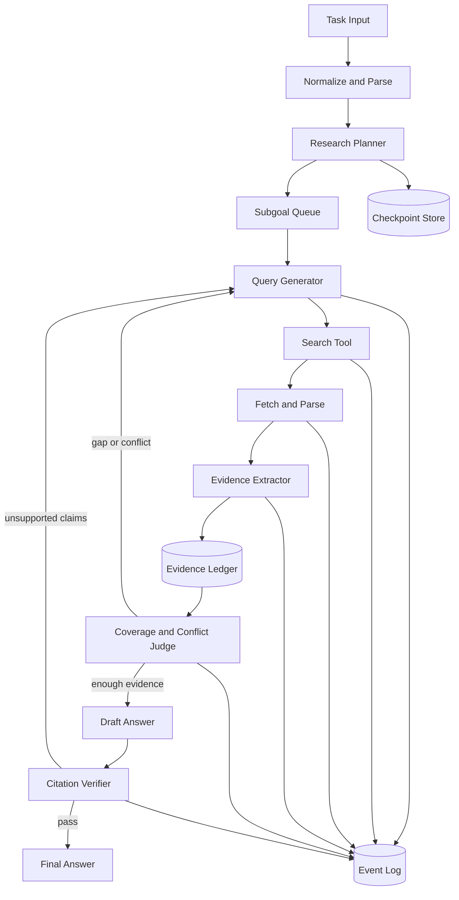

# 课题 1：LLM Agent 深度搜索框架设计文档

> 推荐项目定位：**Verification-Centric Deep Research Harness with Evidence Closure and Failure-Directed Recovery**
>
> 中文名称：**基于证据闭包与错误定向恢复的可验证深度研究 Agent Harness**

## 0. 执行摘要

本项目不追求堆叠大量 Agent，而是围绕一个核心问题展开：**如何把容易失控的 Simple Agent 检索循环，变成可验证、可恢复、可诊断、可复现的长程研究系统。**

最终系统由一个轻量研究状态图和三个关键机制构成：

1. **Evidence Ledger + Claim Graph**：把页面片段转化为带来源、立场、来源类型策略先验和可复算证据充分度的结构化证据，显式表示“哪些证据支持或反驳哪些声明”。这些值不是事实为真的概率。
2. **Evidence Closure**：不让模型凭感觉决定是否结束，而是根据答案槽位、证据覆盖、来源独立性和冲突状态计算缺口，再生成定向查询。
3. **Failure-Directed Recovery**：将失败分为规划、查询、抓取、证据、推理和引用错误，每类错误进入不同恢复路径，避免无差别重试。

当前实现采用六个职责固定的进程内逻辑 Agent：规划、检索、证据整理、完整性审查、写作、引用核验。它们共享同一个 durable run 和 provider 边界，但每次 invocation、计划路由、消费 receipt、阶段产物与质量门分别持久化。这里的“多 Agent”用于职责隔离和可审计协作，不伪装成六个网络远程服务；并行 researcher 和全自动浏览器仍属于需要单独消融与安全预算的扩展。

### 0.1 最终交付

- 一个支持 CLI 和简易网页 UI 的 Deep Research Demo。
- BrowseComp/GAIA 子集上的 baseline、完整系统和消融结果。
- 每题完整研究轨迹：计划、查询、页面、证据、引用、错误、成本和时延。
- 支持进程中断后从 checkpoint 恢复。
- 一条命令运行单题，一条命令批量评测，一条命令生成实验报告。

### 0.2 成功标准

必须同时达到以下四类结果，而不只追求最终答案分数：

| 目标 | 最低验收标准 | 理想目标 |
|---|---:|---:|
| 任务效果 | 相同模型下优于 Simple Agent baseline | BrowseComp 子集准确率提升 8 至 15 个百分点 |
| 引用质量 | 核心声明引用覆盖率不低于 90% | 引用支持率不低于 85% |
| 工程能力 | 任意节点中断后可恢复 | 恢复后无重复搜索和重复计费 |
| 效率 | 有硬预算且不会无限循环 | 在效果提升时 Token/搜索调用增幅小于 30% |

若正式评测分数受模型或搜索服务限制，仍需通过诊断集证明：重复查询下降、引用正确率提高、错误可定位、恢复有效。

## 1. 文档目标

本文给出一个可在约两周内实现和验证的 Deep Research Agent Harness 方案。系统基于给定的 Simple Agent 扩展，不把核心能力绑定到特定模型或搜索服务，并重点满足以下要求：

- 支持问题分解、动态检索、多跳证据收集、冲突处理和带引用回答。
- 支持长程执行、失败重试、断点恢复、预算控制和完整轨迹记录。
- 支持 BrowseComp、GAIA 等任务的可复现评测和细粒度错误分析。
- 能通过消融实验说明各模块是否真正改善结果，而不只展示 Demo。

当前目录未包含题目所说的 Simple Agent 源码，因此本文把其视为实现 `AgentBackend` 接口的黑盒执行内核。拿到实际框架后，只需实现适配层，不应重写其模型调用和基础工具循环。

## 2. 设计结论

### 2.1 推荐架构

采用“确定性 Harness + 可替换 Agent Backend”的分层架构：

- Harness 当前使用项目自建的 LangGraph 风格显式状态图，负责持久化、分支、重试、恢复和观测；这里描述设计形态，不表示已安装或使用 LangGraph 包。
- Simple Agent 只负责单步规划、工具选择或局部子任务求解。
- 搜索、页面获取、证据抽取、引用校验等关键操作由强类型工具实现，不允许只存在于 prompt 中。
- 所有结论必须落入结构化 Evidence Ledger，最终答案只能引用账本中的证据。

不建议直接把整个项目实现为一个无限 ReAct 循环。长程研究的主要困难不是“能否调用搜索工具”，而是状态失控、重复搜索、错误累积、来源不可追踪和失败后无法恢复。

### 2.2 LangGraph 与 smolagents 的取舍

截至 2026-07-19，LangGraph 官方 PyPI 版本为 `1.2.9`，smolagents 为 `1.26.0`；二者在当前 CPython 3.13.9 环境均未安装，状态均为 `candidate`。选型目标保持不变，但不能把候选框架写成当前实现。

| 维度 | smolagents | LangGraph | 本项目选择 |
|---|---|---|---|
| 抽象复杂度 | 低，核心 Agent 循环易读、易改 | 较低层，需要显式定义状态和边 | 外层采用 LangGraph 思路，内层保持简单 |
| Agent 行为 | CodeAgent 或 ToolCallingAgent，适合快速试验 | 不规定 Agent 形式 | Simple Agent 通过适配器接入 |
| 长程恢复 | 需自行补持久化和恢复语义 | 原生 checkpoint、interrupt、resume | 当前显式状态机实现同类语义，保留 LangGraph 迁移边界 |
| 可观测性 | 有 memory/monitoring，但实验账本需自建 | 状态迁移和事件流更自然 | 自建事件日志，不依赖商业平台 |
| 研究灵活性 | 适合快速改 Agent loop | 适合对节点和路由做消融 | 两者思想结合 |
| 两周风险 | 快速，但后期容易补工程债 | 初始代码稍多，但评测和恢复更稳 | 只实现最小状态图，不引入重型服务 |

最终建议不是“全量采用 LangChain 生态”。当前 `current-runtime` 采用显式 async 状态机、SQLite checkpoint、operation ledger、execution lease/fence 和事件 outbox，已经实现可验证的节点恢复语义；LangGraph `1.2.9` 仍作为 `candidate` 生产 runtime 迁移选项。迁移必须证明现有副作用幂等、未知计费结果 fail-closed 和 fence 语义不会因换框架而丢失。

### 2.3 协议与系统边界

| 边界 | 状态 | 当前选择 | 选择依据 | 明确不宣称 |
|---|---|---|---|---|
| 内部六角色 | `current-runtime` | `deep-research-handoff/1.1` | 同进程角色不需要引入 HTTP 分布式失败面；计划路由、消费 receipt 和 canonical artifact 可直接持久化 | 不属于 A2A wire object；没有 receipt 不能称为实际接收 |
| 远程 Agent | `validated-adapter`（receipt 2026-07-20） | A2A Spec 1.0 over JSON-RPC 2.0 / Python SDK 1.1.1 | 适合 opaque Agent 服务发现、长任务和跨框架协作；ACP 官方项目已并入 Linux Foundation 下的 A2A | 仅验证单 Agent、非流式、无 push 的 JSON-RPC 路径；同 Task `input-required` 恢复是 `adapter-blocked` capability gap；不覆盖全部绑定或方法 |
| 工具边界 | `validated-adapter`（receipt 2026-07-20） | MCP 2025-11-25 / Python SDK 1.28.1 / stdio | search/fetch 是有界工具，不是长程决策 Agent | ResearchEngine 当前直接调用 provider；默认网络 provider 的 SSRF 保护不扩散到 custom provider；不把完整引擎、内部角色或 Browser/PDF/Files 称为已实现 MCP 能力 |
| 浏览器 GET 事件 | `current-runtime` | `ag-ui-shaped-v0` 自定义 SSE + polling | 满足当前 dossier 状态投影 | 不属于 AG-UI wire format |
| 前端 POST 事件 | `validated-adapter`（receipt 2026-07-20） | AG-UI Python 0.1.19 测试快照 + TS core/client 0.0.57 精确锁定 | 验证生命周期、状态/消息快照和 interrupt/resume 的一个 HTTP/JSON/SSE profile | 不等于完整 conformance；state/tools/context 和完整多轮推理仍为 `adapter-blocked` |
| 生产编排 | `candidate` | LangGraph 1.2.9 | 保留 durable runtime 迁移目标 | 当前未安装、未导入，不是现有 checkpoint/ledger/lease 的实现 |
| 观测 | `candidate` | OpenTelemetry SDK 1.44.0 + GenAI/MCP conventions + W3C Trace Context | 保留跨模型、工具和协议边界的生产 tracing 目标 | 当前未安装、未埋点、未传播；应用 run_id 不是 W3C trace 证明 |

所有版本和官方来源记录在 `docs/官方协议版本核验_20260718.md`。其中上游值是带查询时间的版本快照，不是依赖锁或实时查询；运行时 `/api/system-contract` 是前端能力声明和服务器解释器 installed version 的 source of truth，而不是上游 latest 的在线 source of truth。只有 `conformance/protocol-validation-receipts.json` 对 `conformance/protocol-validation-evidence-20260720.txt` 的协议/SDK/命令/日期/SHA-256 校验通过时，有限适配才可显示为 `validated-adapter`。

### 2.4 技术核心与优先级

| 优先级 | 技术点 | 为什么重要 | 实现风险 |
|---|---|---|---|
| P0 | 统一事件日志、预算和运行目录 | 没有它就无法复现、评测和定位错误 | 低 |
| P0 | Evidence Ledger | 引用、去重、冲突和覆盖判断的共同基础 | 低 |
| P0 | Evidence Closure | 决定何时继续搜、搜什么、何时停止 | 中 |
| P0 | 引用校验 | 直接体现“可验证”而非普通问答 | 中 |
| P0 | SQLite checkpoint | 满足长程任务恢复要求 | 低 |
| P1 | Failure-Directed Recovery | 形成自主迭代闭环和错误分析亮点 | 中 |
| P1 | 来源独立性与冲突图 | 提高答案可靠性，适合展示案例 | 中 |
| P1 | 查询多样化与反证搜索 | 改善 BrowseComp 长尾检索 | 中 |
| P2 | 多 researcher 并发 | 可能提升覆盖，但增加成本和重复 | 高 |
| P2 | 浏览器 GUI 自动化 | 适合动态页面，但不利于两周稳定交付 | 高 |

实施原则是先完成所有 P0，再根据开发集错误分布选择 P1，避免按功能列表平均分配时间。

### 2.5 三个主要亮点

#### 亮点一：从文本记忆升级为证据图

普通 ReAct Agent 把搜索结果混在对话历史中，后续模型很难判断来源、重复和冲突。本项目将其转成：

```text
Question
  -> Answer Slots
  -> Claims
  -> supporting / contradicting Evidence
  -> Source Documents
```

这使证据覆盖、冲突检测、引用生成和错误归因都能使用确定性数据结构完成。

#### 亮点二：基于证据缺口的闭环检索

系统每轮不是笼统询问“还需要搜索吗”，而是计算：

```text
缺失答案槽位 + 缺少独立来源的声明 + 未解决冲突 + 低证据充分度候选
                         ↓
                  Targeted Search Need
                         ↓
                    定向查询模板
```

该机制与 PEARL 的 semantic closure 思路一致，也最容易通过消融证明价值。

#### 亮点三：错误类型决定恢复动作

`fetch_error` 应切换抓取器，`entity_ambiguity` 应补充消歧词，`citation_error` 应补证据，`budget_loop` 应停止或重规划。将错误恢复写成显式路由，既比“反思后重试”稳定，也能生成有说服力的失败分布图。

## 3. 目标与非目标

### 3.1 功能目标

1. 对输入问题生成研究计划、子问题、预期证据类型和停止条件。
2. 并发执行受控搜索，并根据当前证据缺口动态改写查询。
3. 获取网页后保留原始 URL、抓取时间、标题、正文片段和内容哈希。
4. 对证据去重、聚类，计算可解释但未经概率校准的证据充分度，并标注支持/反驳关系。
5. 在结论存在冲突或证据不足时触发定向再检索。
6. 生成句子级引用，并在提交前验证引用是否支持对应声明。
7. 保存完整运行轨迹，支持按 `run_id` 恢复和重放。
8. 记录准确率、证据覆盖、调用次数、Token、费用、时延和失败类型。

### 3.2 非目标

- 不在两周内训练新的基础模型或搜索模型。
- 不实现通用浏览器 GUI 自动化；优先使用搜索 API 和静态页面抓取。
- 不以多 Agent 数量作为创新点。只有能通过消融证明收益的角色才保留。
- 不承诺对登录墙、验证码、强 JavaScript 页面进行稳定抓取。

## 4. 总体架构



### 4.1 分层

1. `orchestrator`：状态图、路由、预算、重试、恢复。
2. `agent_backend`：封装给定 Simple Agent 或其他模型代理。
3. `tools`：搜索、抓取、解析、代码执行和本地文件读取。
4. `evidence`：证据账本、去重、来源评分、冲突图和引用。
5. `observability`：事件、trace、成本、时延和错误分类。
6. `evaluation`：数据集适配、答案抽取、评分、聚合和报告。

### 4.2 推荐技术栈

| 层 | 首选实现 | 可替换方案 |
|---|---|---|
| 语言与环境 | Python 3.11/3.12、`uv` | `venv`/Poetry |
| 编排 | 当前手写 async 状态机；LangGraph `1.2.9` 为生产迁移候选 | LangGraph `StateGraph`（未安装） |
| 数据模型 | Pydantic v2 | dataclass + JSON Schema |
| checkpoint | SQLite | PostgreSQL |
| 事件日志 | 当前 JSONL + SQLite 汇总 | OpenTelemetry `1.44.0` + W3C Trace Context（候选，未实现） |
| 搜索 | Serper/Tavily adapter | Bing/Google 自定义搜索 |
| 页面正文 | `httpx + trafilatura` | Jina Reader、readability |
| PDF | PyMuPDF | pypdf/pdftotext |
| 近重复 | SimHash/MinHash | embedding cosine |
| UI | Streamlit 或 Gradio | 纯 CLI |
| 批量评测 | 每题独立 subprocess | asyncio worker pool |
| 报告 | pandas + matplotlib | DuckDB + Plotly |

首版避免引入向量数据库、消息队列和分布式服务。数据规模很小，SQLite、JSONL 和本地内容缓存足够，且更容易复现。

当前协议验证解释器为 CPython `3.13.9`。项目已为 `[mcp]` extra 按 Python 版本条件化 Starlette pin；Python 3.14 仍没有安装、启动和协议回归证据，因此只能记录为未验证，不能宣称运行支持。

### 4.3 运行时节点

建议把状态图限制在 10 个节点以内：

```text
START
  -> initialize
  -> plan
  -> select_subgoal
  -> generate_queries
  -> search_and_fetch
  -> ingest_evidence
  -> assess_closure
       -> generate_queries      [证据缺口]
       -> recover              [发生错误]
       -> draft                [证据闭包]
  -> verify_answer
       -> generate_queries      [引用不支持]
       -> finalize             [通过]
END
```

`search_and_fetch` 内部允许受控并发，但状态图本身保持清晰。不要为每个工具调用创建一个 Agent 节点，也不要让一个节点同时负责规划、搜索和总结。

### 4.4 当前三模型协作与多模态输入实现

默认 `team` 配置不是让三个模型同时回答同一份 prompt，而是按角色能力和相互制衡进行路由：

| 阶段 | 默认模型 | 选择理由 | 独立控制 |
|---|---|---|---|
| 附件感知 | GPT | 接收原生图像消息，并把 PDF 渲染页、图像或音频转成带定位观察 | 每份附件独立 operation key，可单独回放 |
| 研究规划 | GPT | 负责回答槽位、子目标和停止条件的结构化规划 | JSON 结构校验 |
| 查询策略 | DeepSeek | 以较低成本生成缺口驱动检索路线 | 重复查询与预算硬门 |
| 证据整理 | DeepSeek | 把已读取正文转成逐字 quote 和结构化 Evidence | 原文定位、来源绑定硬门 |
| 完整性审查 | 本地确定性规则 | 避免任一模型自行批准自己的材料 | 五项逐目标硬门，不允许加权分绕过 |
| 引用约束写作 | GPT | 只消费闭包准入 Evidence ID | Evidence 白名单 |
| 引用核验 | Qwen | 与写作者采用不同模型，降低同源判断偏差 | 声明-引用集合契约与确定性后验检查 |

图像、音频、PDF 和文本附件位于六角色正六边形之前，是一个上游感知阶段，不增加第七个六边形节点。服务端先按实际字节识别 MIME，保存私有内容寻址文件及 SHA-256/长度清单，再逐附件执行感知。每条观察必须带 `page/region/time` locator、模型 ID 和 `confidence`。这里的 `confidence` 是未校准的模型输出，只用于人工复核排序；附件材料要进入 Evidence，还必须满足：

```text
manifest_valid
and exact_observation_text_match
and locator_present
and perception_model_present
and grounding_confidence >= 0.80
```

即使全部满足，一个用户附件仍只代表一个用户输入来源，不能单独通过独立来源门。模型配置中的 `*_MODALITIES` 是运维声明，不是外部网关能力证明；只有对精确网关与模型 ID 的原生媒体请求成功后，才可把对应模态标记为已验证。

## 5. 核心状态模型

```python
class ResearchState(TypedDict):
    run_id: str
    task: str
    normalized_task: str
    plan: list[Subgoal]
    open_subgoals: list[str]
    active_subgoal: str | None
    query_history: list[QueryRecord]
    page_index: dict[str, PageRecord]
    evidence_ids: list[str]
    claim_graph: dict[str, ClaimNode]
    draft_answer: str | None
    verification: VerificationReport | None
    budgets: BudgetState
    counters: RunCounters
    failure_history: list[FailureRecord]
    status: Literal["running", "completed", "failed", "budget_exhausted"]
```

关键约束：

- 状态中只保存可序列化数据，不保存打开的客户端、协程或浏览器对象。
- 大正文写入内容寻址对象存储，状态只保存 `content_hash` 和路径。
- 每个节点必须幂等；节点重试不应重复计费或重复写入证据。
- 每完成一个有外部副作用的节点就保存 checkpoint。

## 6. 模块详细设计

### 6.1 问题解析与研究计划

规划器输出结构化计划，而不是自由文本：

```json
{
  "answer_type": "short_text",
  "subgoals": [
    {
      "id": "sg1",
      "question": "待验证子问题",
      "dependencies": [],
      "expected_evidence": ["official_page", "independent_source"],
      "done_when": "至少两个独立来源一致"
    }
  ],
  "global_stop": {
    "max_search_calls": 30,
    "max_wall_seconds": 900
  }
}
```

计划允许增量修改，但必须记录 `plan_revision` 和修改原因。依赖关系只用于排序，不要求实现复杂 DAG 调度器。

为提高稳定性，计划器还需生成 `answer_slots`。例如问题要求“人物、时间和原因”，则至少生成三个槽位。Evidence Closure 直接检查槽位，不必重新理解整个原始问题。

```python
class AnswerSlot(BaseModel):
    id: str
    description: str
    required: bool = True
    value: str | None = None
    supporting_evidence: list[str] = []
    confidence: float = 0.0
```

### 6.2 动态查询生成

每次查询由四部分生成：子目标、已有证据摘要、未覆盖槽位、历史失败查询。查询策略包含：

- 实体消歧：加入时间、地点、机构、别名。
- 来源定向：`site:`、官方域名、论文/新闻/数据库类型。
- 反证搜索：对当前候选答案主动搜索相反说法。
- 桥接查询：将前一跳得到的实体用于下一跳。
- 查询多样化：限制与历史查询的 token/Jaccard 相似度。

同一轮最多并发 3 个查询，避免搜索结果高度重叠和成本失控。

### 6.3 页面获取与解析

`fetch_page(url)` 返回：

```python
class PageRecord(BaseModel):
    canonical_url: str
    fetched_at: datetime
    status_code: int
    title: str | None
    text_path: str | None
    content_hash: str | None
    mime_type: str | None
    parser: str
    error: str | None
```

处理顺序：HTTP 获取、canonical URL 归一化、正文抽取、必要时 PDF 解析、内容哈希去重。动态网页抓取失败后只允许一次浏览器降级，之后标记为 `blocked_dynamic_page`，避免循环重试。

### 6.4 Evidence Ledger

证据是系统的中心数据结构：

```python
class Evidence(BaseModel):
    id: str
    subgoal_id: str
    claim: str
    quote: str
    source_url: str
    source_title: str | None
    published_at: date | None
    retrieved_at: datetime
    locator: str
    stance: Literal["supports", "contradicts", "context"]
    source_type: str
    reliability: float
    extraction_confidence: float
    content_hash: str
```

去重采用三级策略：

1. URL canonicalization 去掉 tracking 参数。
2. 正文内容哈希识别镜像和转载。
3. 对 evidence quote 做 embedding/MinHash 近重复聚类。

来源评分仅作为排序特征，不作为事实真伪的唯一判据。建议特征包括来源类型、是否第一方、作者/机构可识别性、发布时间、是否有原始数据、多个独立来源是否一致。

建议采用可解释的启发式初始评分，而不是训练模型：

```text
reliability =
  0.25 * source_type_score
  + 0.20 * first_party_score
  + 0.15 * author_identifiability
  + 0.15 * recency_fit
  + 0.15 * cross_source_agreement
  + 0.10 * extraction_confidence
```

同一新闻稿的多个转载不算独立来源。可使用内容哈希、canonical URL 和引用链判断 `source_cluster_id`，覆盖率统计按来源簇计数。

### 6.5 Evidence Closure

Evidence Closure 是本项目最核心的算法模块。它对每个答案槽位和候选声明计算：

```python
closure_score = (
    0.35 * slot_coverage
    + 0.25 * source_independence
    + 0.20 * evidence_entailment
    + 0.10 * source_reliability
    + 0.10 * conflict_resolution
)
```

建议初始阈值：

- 必需槽位 `slot_coverage == 1`。
- 核心声明至少一个高质量来源；容易产生争议的声明要求两个独立来源。
- 未解决的高置信度反驳证据数为 0，或已明确标注不确定性。
- 全局 `closure_score >= 0.75` 才允许生成最终答案。

若未闭包，输出结构化缺口：

```json
{
  "closed": false,
  "gaps": [
    {
      "type": "missing_independent_source",
      "slot_id": "slot_2",
      "claim": "...",
      "preferred_source": "official_record",
      "query_hints": ["...", "..."]
    }
  ]
}
```

查询生成器只处理这些 gap，形成可解释的搜索闭环。

### 6.6 冲突处理

对每个候选声明维护支持集和反驳集。出现冲突时：

1. 判断是否只是时间版本不同、定义不同或实体消歧错误。
2. 优先寻找第一方或原始材料。
3. 生成明确的裁决查询，而不是继续宽泛搜索。
4. 无法裁决时，在答案中保留不确定性和双方来源，不得静默选择。

### 6.7 覆盖判断与停止条件

停止条件应由确定性预算和模型判断共同决定：

- 所有必需子目标达到最低证据数。
- 核心声明至少有一个可访问、可定位的来源。
- 高优先级冲突已解决或被显式披露。
- 最近两轮新增有效证据低于阈值。
- 达到搜索、Token、费用或时间硬上限。

模型只负责判断“证据是否充分”，硬预算由程序强制执行。

### 6.8 回答与引用验证

回答生成器收到的上下文只包含 Evidence Ledger，而不是全部网页。生成格式要求句子级引用，如 `[E12]`。随后执行两阶段校验：

1. 结构校验：引用 ID 存在、URL 可定位、关键声明有引用。
2. 语义校验：用 NLI/LLM judge 判断 quote 是否蕴含对应声明。

若存在 unsupported claim，只把失败声明及其证据缺口送回查询生成器，避免整轮重跑。

语义校验推荐使用“便宜模型初筛 + 强模型复核边界样本”：

- 明显词面不匹配或引用缺失，确定性规则直接失败。
- 普通引用用小模型输出 `entailed / partial / unsupported`。
- 仅对 `partial` 或核心声明调用强模型复核。

这样能控制评测成本，同时保留较好的引用可靠性。

### 6.9 错误归因与自主迭代

统一错误分类：

- `planning_error`：关键子目标缺失。
- `query_error`：查询过宽、实体错误或重复。
- `retrieval_miss`：搜索结果未覆盖目标证据。
- `fetch_error`：网络、权限、动态页面或解析失败。
- `evidence_error`：抽取错、来源低质、去重误判。
- `reasoning_error`：证据存在但结论错误。
- `citation_error`：引用不存在或不支持声明。
- `budget_error`：无收益循环导致预算耗尽。

重试策略必须由错误类型决定。例如 429 使用指数退避，404 不重试，解析失败切换解析器，引用错误回到证据补全，而不是统一“再问模型一次”。

### 6.10 查询策略的可实现版本

为了兼顾效果和开发周期，查询生成不需要复杂强化学习，采用四类模板即可：

1. `broad_discovery`：寻找候选实体和关键词，仅用于第一轮。
2. `entity_resolution`：对同名实体补充机构、年份、地点等限定。
3. `source_targeting`：根据缺口指定官网、论文、数据库或新闻档案。
4. `contradiction_check`：围绕当前结论搜索否定词、争议、更新和勘误。

每轮候选查询先进行规范化和去重，再用简单 novelty score 排序：

```python
novelty = 1.0 - max(similarity(query, old_query) for old_query in history)
priority = 0.5 * gap_importance + 0.3 * novelty + 0.2 * source_specificity
```

这比让模型一次生成十几个搜索词更节省调用，也更容易解释。

### 6.11 缓存与幂等

效果评测必须避免网络随机性掩盖算法差异：

- 搜索缓存键：`provider + normalized_query + top_k + date_bucket`。
- 页面缓存键：canonical URL；正文按内容哈希保存。
- 模型缓存键：模型、prompt 版本、结构化输入哈希、temperature。
- 正式比较时可同时报告 `live-web` 和 `replay-cache`；消融优先使用 replay，确保输入一致。

缓存命中仍写事件，但费用和网络时延单独标记为 0，避免统计混乱。

## 7. Agent Backend 接口

```python
class AgentBackend(Protocol):
    async def plan(self, request: PlanRequest) -> Plan: ...
    async def propose_queries(self, request: QueryRequest) -> list[Query]: ...
    async def extract_evidence(self, request: ExtractRequest) -> list[Evidence]: ...
    async def judge_coverage(self, request: CoverageRequest) -> CoverageDecision: ...
    async def draft(self, request: DraftRequest) -> DraftAnswer: ...
    async def verify(self, request: VerifyRequest) -> VerificationReport: ...
```

给定 Simple Agent 可以实现全部方法，也可以只实现通用 `invoke(messages, tools, schema)` 后由适配器构造 prompt。这样可以同时测试：

- Simple Agent baseline。
- Simple Agent + Harness。
- 同 Harness、不同模型。
- 同模型、不同 orchestration 策略。

## 8. 可观测性与复现

### 8.1 事件模型

每个事件以 JSONL 记录：

```json
{
  "event_id": "uuid",
  "run_id": "...",
  "step": 17,
  "node": "search",
  "event_type": "tool_finished",
  "started_at": "...",
  "duration_ms": 842,
  "input_ref": "sha256:...",
  "output_ref": "sha256:...",
  "model": null,
  "tokens": 0,
  "cost_usd": 0.002,
  "error": null
}
```

应保存配置快照、Git commit、模型名、temperature、prompt 版本、工具版本和数据集版本。敏感 API key 不进入日志。

### 8.2 目录建议

```text
deep-research-harness/
  configs/
  src/
    orchestrator/
    agent_backend/
    tools/
    evidence/
    observability/
    evaluation/
  tests/
  scripts/
  runs/<run_id>/
    config.json
    events.jsonl
    checkpoints.sqlite
    artifacts/
    final.json
```

### 8.3 面向人的研究驾驶舱

UI 必须让普通用户先获得结论和当前决策，再按需进入完整审计面；不能把内部 JSON、哈希和协议字段直接堆在首屏。当前页面采用分层驾驶舱：

1. `Answer First`：完成态优先展示最终回答、逐句引用核验和可点击 Evidence ID。
2. `Research Now`：当前执行角色、输入、操作、输出、推进或阻断依据。
3. `Hard Gates`：目标覆盖、来源门、原文定位、反证检查、冲突裁决分别显示等待/通过/阻断/历史不可验证。
4. `Collaboration`：固定六角色设计拓扑与真实 invocation 序列分开；计划路由和 receipt 分开；回放不计为 provider 调用。
5. `Sources and Evidence`：检索路线、文章、原文证据和回答目标关系图，文章调研顺序、source snapshot 和 canonical artifact 均可人工复算。
6. `Runtime Audit`：checkpoint、operation replay、execution lease/fence、协议边界、Token 和费用完整保留，但通过渐进披露呈现。

老师应能在 30 秒内看出系统当前做什么、为何继续或停止、结论依据什么；随后能沿 receipt、artifact、Evidence ID 和 source snapshot 完成人工查验。

## 9. 评测设计

### 9.1 数据集

- BrowseComp：核心压力测试。答案短、可自动评分，但检索路径长，适合测持续搜索能力。
- GAIA：补充多工具、多模态和真实文件处理能力。建议先使用公开 validation 子集。
- 自建诊断集：20 至 30 题，分别覆盖多跳、时效性、冲突来源、PDF、同名实体和动态页面。

两周内不要一开始跑完整数据集。先固定 10 题开发集，系统稳定后再跑 50 至 100 题报告结果。

### 9.2 指标

| 类别 | 指标 |
|---|---|
| 结果 | Exact Match、任务完成率、judge score |
| 证据 | evidence recall、核心声明覆盖率、引用正确率、引用可访问率 |
| 过程 | 搜索次数、页面数、重复查询率、无效页面率、恢复成功率 |
| 效率 | 输入/输出 Token、费用、端到端时延、并发利用率 |
| 稳定性 | 多次运行方差、失败类型分布、预算耗尽率 |

### 9.3 Baseline 与消融

最少完成以下实验：

1. `B0`：给定 Simple Agent 原始版本。
2. `B1`：加问题分解和动态查询。
3. `B2`：`B1 + Evidence Ledger + 去重`。
4. `B3`：`B2 + 冲突检测 + 引用验证`。
5. `B4`：完整系统，包括 checkpoint、错误路由和预算控制。

消融至少包括：去掉来源评分、去掉反证搜索、去掉引用验证、固定查询替代动态查询。每项报告效果、成本和时延，而不是只报告准确率。

### 9.4 开发集选择

开发阶段人工选择 12 至 20 题并按失败能力分层：

| 类型 | 数量建议 | 主要验证点 |
|---|---:|---|
| 单跳但难搜 | 3 | 查询改写、来源定向 |
| 两至三跳实体链 | 4 | 子目标依赖、桥接查询 |
| 多来源冲突 | 3 | 反证搜索、冲突裁决 |
| 时间敏感 | 2 | 发布时间和版本判断 |
| PDF/表格 | 2 | 文件抓取和定位引用 |
| 同名实体 | 2 | 实体消歧 |

不得只挑完整系统能成功的题。每道题在开发日志中记录 baseline 失败原因，后续技术模块必须对应真实失败类型。

### 9.5 结果表模板

```text
System                  Acc   Citation-Support  Search  Tokens  Time  Recovery
Simple Agent            ...       ...            ...     ...    ...     N/A
+ Planning              ...       ...            ...     ...    ...     ...
+ Evidence Ledger       ...       ...            ...     ...    ...     ...
+ Evidence Closure      ...       ...            ...     ...    ...     ...
+ Failure Recovery      ...       ...            ...     ...    ...     ...
```

主结果表控制在一页内，另外展示一张失败类型堆叠图和一张效果/成本 Pareto 图。

## 10. 两周实施计划

| 日期 | 目标 | 验收物 |
|---|---|---|
| Day 1-2 | 复现 Simple Agent，建立 10 题开发集和 baseline | baseline 轨迹与评分 |
| Day 3-4 | 工具适配、统一事件日志、预算统计 | 可重放单题运行 |
| Day 5-6 | 状态图、规划、动态查询、checkpoint | 中断后可恢复 |
| Day 7-8 | Evidence Ledger、去重、来源评分 | 证据可追踪 |
| Day 9 | 冲突检测和定向再检索 | 冲突诊断案例 |
| Day 10 | 回答生成和引用验证 | 句子级引用报告 |
| Day 11-12 | 50 至 100 题评测、消融 | 汇总表和失败分布 |
| Day 13 | Demo、可视化和典型案例 | 可交互运行页面/CLI |
| Day 14 | 复现实验、PPT、文档收敛 | 一键运行脚本 |

### 10.1 三阶段验收门

#### Gate A：基础可用，最晚 Day 4

- 单题可以完整运行。
- 工具、模型和成本事件均被记录。
- Simple Agent baseline 可复现。

若未通过，停止开发高级策略，先修基础设施。

#### Gate B：核心闭环，最晚 Day 9

- Evidence Ledger、Evidence Closure 和引用验证全部跑通。
- 至少 5 道开发题能展示“发现缺口 → 定向再检索 → 闭包”的轨迹。
- 进程中断后可从 checkpoint 恢复。

#### Gate C：可汇报，最晚 Day 12

- 正式子集结果、至少 3 项消融和失败分布完成。
- Demo 有成功、冲突和恢复三个案例。
- 所有表格可由脚本重新生成。

### 10.2 时间不足时的裁剪顺序

按以下顺序删除功能，不影响核心叙事：

1. 删除多 Agent 并发。
2. 删除浏览器 GUI 自动化。
3. 删除 embedding 去重，改用 SimHash。
4. 删除复杂来源学习模型，保留启发式评分。
5. UI 降级为 Streamlit/CLI，但保留轨迹和引用查看。

不可删除 Evidence Ledger、Evidence Closure、引用验证、checkpoint 和 baseline/消融。

## 11. 风险与降级方案

- 搜索 API 不稳定：定义统一 `SearchProvider`，至少准备两个 provider 或缓存搜索结果。
- 抓取受限：保留失败类别，Demo 选择公开稳定页面，不伪造证据。
- 模型费用过高：开发期使用缓存和小模型做抽取，只在规划/裁决使用强模型。
- LangGraph 接入成本超预期：保留相同节点和状态 schema，改为手写 `while + router + SQLite`。
- 评测答案泄漏：开发集与正式集分离，prompt 不包含 benchmark 名称和参考答案。
- 多 Agent 收益不稳定：默认单 Agent 多阶段；并行 researcher 作为可选消融，不作为主线依赖。

### 11.1 最可能影响效果的三个问题

1. **基础模型不会稳定输出结构化结果**：所有关键调用使用 JSON Schema/Pydantic 校验；失败时做一次修复调用，再失败则进入可记录错误，不无限重试。
2. **搜索结果质量决定上限**：至少准备一个稳定搜索 API，并用 source-targeting 与多样化查询降低 provider 偏差。
3. **评测规模过小导致结论偶然**：开发集可小，正式报告至少跑 50 题；若费用受限，采用固定缓存重复运行并报告置信区间。

## 12. 实现指南

### 12.1 推荐代码结构与实现顺序

```text
src/
  app.py
  graph.py
  state.py
  schemas.py
  nodes/
    initialize.py
    plan.py
    query.py
    retrieve.py
    evidence.py
    closure.py
    recover.py
    answer.py
    verify.py
  tools/
    search.py
    fetch.py
    pdf.py
  storage/
    checkpoint.py
    cache.py
    event_log.py
  eval/
    datasets.py
    runner.py
    judges.py
    report.py
```

实现顺序必须按依赖推进：

```text
schemas/state
  -> event log and cache
  -> search/fetch tools
  -> baseline adapter
  -> evidence ingest
  -> closure
  -> answer/verify
  -> recovery
  -> batch eval/UI
```

不要先做 UI，也不要先写多 Agent prompt。

### 12.2 关键伪代码

```python
async def assess_closure(state: ResearchState) -> Command:
    report = closure_engine.evaluate(
        slots=state["answer_slots"],
        claims=state["claim_graph"],
        evidence=ledger.load(state["evidence_ids"]),
    )

    if state["budgets"].exhausted:
        return Command(update={"closure": report}, goto="draft")
    if report.high_priority_errors:
        return Command(update={"closure": report}, goto="recover")
    if report.closed:
        return Command(update={"closure": report}, goto="draft")

    return Command(
        update={"closure": report, "search_needs": report.gaps},
        goto="generate_queries",
    )
```

```python
async def verify_answer(state: ResearchState) -> Command:
    report = await verifier.verify(state["draft_answer"], ledger)
    if report.passed:
        return Command(update={"verification": report}, goto="finalize")
    if state["budgets"].can_search and report.repairable_gaps:
        return Command(
            update={
                "verification": report,
                "search_needs": report.repairable_gaps,
            },
            goto="generate_queries",
        )
    return Command(update={"verification": report}, goto="finalize")
```

### 12.3 Prompt 设计原则

关键 prompt 不要求展示长思维链，只要求结构化结论和短理由：

- Planner：输出槽位、子目标、依赖和完成条件。
- Evidence extractor：只抽取页面明确表达的内容，不进行跨页面推理。
- Closure judge：指出缺口类型和需要的来源，不直接生成查询。
- Query generator：只根据 gap 生成少量高区分度查询。
- Citation verifier：逐声明判断引用支持程度并返回可修复缺口。

将“判断缺口”和“生成查询”拆开，可以降低模型同时规划和执行导致的漂移。

## 13. Demo 设计

Demo 应展示一个成功案例和一个失败后恢复案例：

1. 输入问题后展示研究计划和预算。
2. 实时展示查询、页面、证据和支持/反驳关系。
3. 人为终止进程，再从 checkpoint 恢复。
4. 展示最终答案中每条引用对应的原文片段。
5. 展示 baseline 与完整系统的调用次数、耗时、成本和结果差异。

## 14. 参考资料调研

### 14.1 BrowseComp

Jason Wei 等，2025，arXiv:2504.12516。数据集包含 1,266 个答案较短但信息难以找到的问题，核心考察持续、创造性的网页检索。它适合测最终答案准确率和长程检索，但不直接评价长报告质量、歧义消解或完整引用，因此本项目必须自行补充证据和引用指标。

设计启示：将其作为主要端到端基准；同时记录搜索深度、重复查询和证据路径，避免只做答案分数优化。

链接：https://arxiv.org/abs/2504.12516

### 14.2 GAIA

Grégoire Mialon 等，2023，arXiv:2311.12983。GAIA 包含 466 个真实世界问题，综合考察推理、网页浏览、多模态和工具使用。论文报告人类约 92%，当时配备插件的 GPT-4 约 15%，说明“概念简单但执行链复杂”是 Agent 的关键难点。

设计启示：用于验证 Harness 是否能处理文件、多模态和异构工具；题目分级也适合分析系统随任务复杂度的退化。

链接：https://arxiv.org/abs/2311.12983

### 14.3 ApodexAI AgentHarness

该项目是 Apodex-1.0 在公开 Deep Research 基准上的评测 Harness，采用标准 ReAct 流程，覆盖 BrowseComp、BrowseComp-ZH、DeepSearchQA、WideSearch 等。值得借鉴的工程点是：每题独立子进程、可单题重跑、超时进程可终止、benchmark/judge/pipeline 分层。

不应直接照搬其结果作为本项目 baseline，因为其模型、数据包和服务配置不同；应借鉴评测隔离、数据集注册和 judge 适配设计。

调研快照 commit：`0e1669e070c26399405a8ba229b2bb2fe5b56f9f`

链接：https://github.com/ApodexAI/AgentHarness

### 14.4 LangChain Deep Agents

Deep Agents 是构建在 LangChain Agent 与 LangGraph runtime 之上的 opinionated harness，提供规划、文件系统、子 Agent、上下文压缩、skills、memory 和 backend。其架构明确区分：LangGraph 负责状态/checkpoint/streaming，LangChain 负责模型工具循环，Deep Agents 通过 middleware 叠加 Harness 能力。

设计启示：本项目也应把“运行时持久化”“Agent 决策”“Harness 策略”解耦。但两周项目不宜全量引入其文件系统、skills 和子 Agent，仅借鉴中间件、状态和 backend 边界。

调研快照 commit：`ddce7c3f524109b10ea13ef56afbd1ac99f9e300`

链接：https://github.com/langchain-ai/deepagents

### 14.5 smolagents

smolagents 当前官方 PyPI 版本为 `1.26.0`，本项目未安装，状态为 `candidate`。它强调最小抽象，提供 CodeAgent 和 ToolCallingAgent。CodeAgent 将工具操作写成代码，可在一次模型调用中执行循环或组合多个工具；官方当前明确说明 `LocalPythonExecutor` 不是安全边界，非可信代码必须进入真实沙箱。下述 `6cfdf...` 历史快照曾报告 Open Deep Research 在 GAIA validation 上达到 55% pass@1；当前 main README 已不再承载该数字，因此该结果只能作为 commit-pinned 历史背景，不能作为当前版本能力声明。

设计启示：适合作为 Simple Agent 的轻量实现参考，也适合验证“代码动作是否减少调用步数”。但持久化、证据账本和错误恢复仍需 Harness 补齐。

调研快照 commit：`6cfdf12ee5e77443049177b274b13cf935b0367e`

链接：https://github.com/huggingface/smolagents

### 14.6 LangGraph

LangGraph 当前官方 PyPI 版本为 `1.2.9`，本项目未安装，状态为 `candidate`。它是面向长运行、有状态工作流的低层编排 runtime，核心能力包括 durable execution、checkpoint、interrupt、streaming 和共享状态。它不要求使用 LangChain 的高层 Agent，也不限制节点内部模型；这些框架能力不自动提供本项目 operation ledger、副作用幂等、未知计费结果处理或 execution fence。

设计启示：最适合承载本课题需要展示的断点恢复、错误路由和过程可观测性；应避免把业务逻辑隐藏在一个巨大节点中，否则状态图失去意义。

调研快照 commit：`95af6a00718588e7b7ce17310e8006d267896a77`

链接：https://github.com/langchain-ai/langgraph

## 15. 汇报建议

14 分钟展示建议按“问题 2 分钟、架构 4 分钟、算法细节 3 分钟、实验 3 分钟、Demo/总结 2 分钟”组织。最重要的创新表述应是：通过证据账本和错误类型驱动的闭环，把不可控的简单 Agent 循环变成可恢复、可诊断、可验证的研究系统。不要把“使用了某个框架”本身描述为创新。

## 16. 当前实现状态

核心 Harness、六个进程内逻辑 Agent、上游多模态感知、Qwen/GPT/DeepSeek 角色路由、真实网页搜索、Evidence Ledger、Evidence Closure、冲突裁决、引用修复、checkpoint、operation replay、execution lease/fence、崩溃恢复、canonical artifact、receipt 审计和交互式前端属于 `current-runtime`。运行页分别展示配置路线和实际 invocation 的 provider、模型 ID、输入模态，不把角色设计当成执行证明；附件页展示原始文件、SHA-256、manifest、感知定位和量化边界。A2A、MCP 和 AG-UI POST 仅是上述明确边界内、由 2026-07-20 回执锚定的 `validated-adapter`，不是完整协议认证。自动化测试数量以当前测试命令结果为准，不在文档中固化易过期数字。LangGraph 1.2.9、smolagents 1.26.0、OpenTelemetry/W3C 均未安装或接入，仍为 `candidate`；组织方 Simple Agent 适配和官方 BrowseComp/GAIA 实验为 `adapter-blocked`，因为工作区没有对应框架与数据文件。代码保留 provider、runtime 和 dataset 迁移接口，不削弱这些设计目标。
