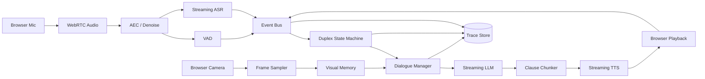

# 课题 2：全双工主动语音对话交互系统设计文档

## 1. 文档目标

本文设计一个可在约两周内实现的网页端实时多模态语音助手。系统采用模块化 ASR → LLM → TTS 路线，通过全链路流式处理、显式抢话状态机和低频视觉上下文，实现：

- 用户和助手可同时收听与说话。
- 用户可自然打断助手，系统能区分有效抢话、附和词和背景噪声。
- 助手可在有限且可解释的条件下主动插话。
- 摄像头画面可作为持续更新的视觉上下文参与回答。
- 端到端时延、打断行为和多模态效果均可测量、复现和演示。

当前目录未包含题目所说的交互系统原型，因此本文把原型视为可替换的音频输入/输出和 UI 层，核心逻辑通过协议接口接入。

## 2. 设计结论

### 2.1 推荐技术路线

选择模块化流式管线，而不是在两周内训练或深度改造端到端 Omni 模型：

```text
Browser microphone
  -> WebRTC/WebSocket audio uplink
  -> AEC + VAD + streaming ASR
  -> dialogue/event state machine
  -> streaming LLM
  -> clause chunker
  -> streaming TTS
  -> jitter buffer + browser playback

Browser camera
  -> sampled frames
  -> visual change detector / captioner
  -> timestamped visual memory
  -> dialogue context selector
```

模块化路线便于替换模型、定位时延、独立评测 VAD/ASR/TTS，并与 X-Talk 的核心结论一致：经过系统性优化的级联 S2S 管线可以兼顾亚秒级响应和工程灵活性。

### 2.2 Agent 框架是否适用

本课题的 `current-runtime` 设计是毫秒级实时事件处理，不应使用 LangGraph 或 smolagents 驱动音频帧。截至 2026-07-19，LangGraph `1.2.9` 与 smolagents `1.26.0` 均只是未安装、未接入的 `candidate`；通用 Agent 框架只适合后续承载低频工具调用或复杂任务规划。

- 音频、VAD、ASR partial、TTS playback 使用 `asyncio` 事件总线和显式有限状态机。
- LLM 回合决策使用可替换 `DialoguePolicy`，允许普通模型或 Agent 调用工具。
- 若 Demo 后续需要查天气等工具，可评估 smolagents 的轻量 ToolCallingAgent，或把工具节点接入 LangGraph 子图；完成依赖、时延和隔离验证前不能画成当前路径。
- 不允许 checkpoint 或 Agent 调度阻塞实时音频线程。

## 3. 目标与非目标

### 3.1 功能目标

1. 支持 16 kHz 单声道 PCM/Opus 音频上行和流式播放。
2. ASR 持续输出 partial/final transcript。
3. 助手播放语音时仍持续运行 VAD 和 ASR。
4. 用户有效抢话后 200 ms 级停止本地播放，并取消后续 TTS/LLM 输出。
5. 支持助手在高价值事件发生时主动发言，但有冷却和频率上限。
6. 每 1 至 2 秒采样视觉输入，仅在场景变化或查询需要时调用视觉模型。
7. 记录端到端时延分解、状态迁移和音频事件，支持离线重放。

### 3.2 非目标

- 不训练新的 ASR、TTS 或 Omni 基础模型。
- 不追求多人会议级说话人分离。
- 不承诺在无耳机、强外放、强混响环境下完全消除回声。
- 不让助手任意主动打断；主动行为必须由规则门控和用户设置约束。

## 4. 总体架构



### 4.1 进程边界

- 浏览器：采集、回声消除配置、播放、UI 和播放立即停止。
- Realtime gateway：WebRTC/WebSocket 会话、帧时间戳、背压和断线重连。
- Speech worker：VAD、ASR、TTS adapter。
- Dialogue worker：状态机、上下文、LLM、主动策略和工具调用。
- Vision worker：帧变化检测、caption/embedding、视觉记忆。

两周 Demo 可将后三者放在同一 Python 进程中，但接口和队列应保持独立。

## 5. 实时事件模型

所有事件都携带单调时钟时间戳和 `turn_id`：

```python
class RealtimeEvent(BaseModel):
    session_id: str
    turn_id: str | None
    seq: int
    monotonic_ms: int
    type: Literal[
        "speech_start", "speech_end",
        "asr_partial", "asr_final",
        "llm_token", "llm_done",
        "tts_chunk", "playback_started", "playback_stopped",
        "vision_update", "cancel_turn", "error"
    ]
    payload: dict
```

使用有界异步队列。音频帧队列满时优先丢弃过旧帧，文本和控制事件不得丢失。每一条输出链必须支持 cancellation token。

## 6. 全双工状态机

### 6.1 状态

```text
IDLE
LISTENING
THINKING
SPEAKING
OVERLAP_PENDING
USER_TURN
PROACTIVE_PENDING
RECOVERING
```

状态不是互斥音频能力的代名词。例如 `SPEAKING` 时系统仍持续监听；状态表示当前对话控制权和输出策略。

### 6.2 用户打断助手

不能在 VAD 一触发时立即永久取消，否则键盘声、回声和“嗯嗯”都会造成误打断。建议两阶段处理：

1. `speech_start` 后立即降低播放音量或暂停本地 jitter buffer，获得快速主观响应。
2. 等待 150 至 350 ms 的 ASR partial 和声学证据，判断是否为有效抢话。
3. 若有效，广播 `cancel_turn`，取消 LLM、未发送 TTS、服务端音频和浏览器播放。
4. 若是短附和词或回声，恢复播放；必要时把附和词作为非抢话反馈写入上下文。

打断分数可以先采用可解释规则：

```text
interrupt_score =
  0.35 * speech_duration
  + 0.25 * asr_semantic_content
  + 0.20 * energy_over_echo_floor
  + 0.20 * address_or_command_signal
```

满足以下任一条件可直接打断：明确停止词，用户纠正事实，用户提出新问题，连续语音超过阈值。仅“嗯、对、好的”等 backchannel 默认不打断。

### 6.3 助手主动打断用户

主动插话比被打断风险高，必须采用“候选生成 + 策略门控”：

- 高优先级：安全风险、明显操作错误、用户明确请求实时提醒。
- 中优先级：用户长时间停顿且上下文表明需要帮助、画面出现与任务强相关变化。
- 低优先级：一般性补充、重复说明、仅为活跃气氛。默认不插话。

门控条件：置信度阈值、最小用户发言时长、停顿窗口、距上次主动发言的冷却时间、每分钟上限和用户可配置偏好。

主动发言前可先播放极短 earcon 或“等一下”，但 Demo 中应允许关闭，避免显得侵扰。

## 7. 流式 ASR → LLM → TTS

### 7.1 ASR

ASR adapter 至少支持：

```python
class StreamingASR(Protocol):
    async def start(self, session: ASRSession) -> None: ...
    async def push_audio(self, frame: AudioFrame) -> None: ...
    async def events(self) -> AsyncIterator[ASREvent]: ...
    async def cancel(self) -> None: ...
```

保留 partial 文本的稳定前缀，避免每次修订都重启 LLM。第一版只在 `asr_final` 后启动回答；优化版可在稳定 partial 满足意图条件时 speculative prefill，但不得提前播放未经确认的答案。

### 7.2 LLM 流式生成

Dialogue Manager 向 LLM 提供：最近对话、当前稳定 transcript、相关视觉记忆、主动策略和工具结果。第一 token 到达后不立即逐 token 送 TTS，而由 clause chunker 按标点、长度和超时切分。

建议首块 12 至 30 个汉字，后续块适当增大。太小会造成 TTS 韵律破碎，太大会增加首音延迟。

### 7.3 TTS 与播放

- TTS adapter 必须支持文本增量输入或并行短句合成。
- 输出音频携带 `turn_id` 和 `chunk_id`，取消后浏览器丢弃旧 turn 的所有晚到分片。
- 浏览器维持 100 至 250 ms jitter buffer，避免网络抖动；打断时立即清空。
- 服务端记录“生成时间”，浏览器回传“实际播放开始/停止时间”，否则无法准确计算用户感知时延。

## 8. 视觉信息感知

### 8.1 采样与变化检测

不应把摄像头 30 FPS 全部发送给多模态模型。建议：

- 浏览器每秒采样 1 至 2 帧，压缩到 512 至 768 像素长边。
- 使用感知哈希、颜色直方图或轻量 embedding 判断场景变化。
- 只有变化超过阈值、用户提到“这个/这里/我手上”，或主动策略需要时才调用视觉模型。

### 8.2 Visual Memory

```python
class VisualObservation(BaseModel):
    observed_at_ms: int
    frame_ref: str
    caption: str
    entities: list[str]
    actions: list[str]
    confidence: float
    embedding_ref: str | None
    expires_at_ms: int
```

视觉上下文必须带时间。回答“你现在看到什么”使用最新帧；回答“刚才我拿的是什么”可检索短期视觉记忆。过期观察不得作为当前场景事实。

### 8.3 隐私

- 页面明确显示摄像头/麦克风状态。
- 默认不持久保存原始音视频，只保存指标和经用户允许的诊断片段。
- 视觉帧设置短 TTL，关闭会话后清理。
- 发送云端模型前在 UI 中说明数据流向。

## 9. 上下文与对话管理

上下文分成四层：

1. 当前 turn：ASR partial/final、正在生成的回答和 cancellation 状态。
2. 短期对话：最近若干回合原文。
3. 会话摘要：稳定事实、用户偏好和未完成任务。
4. 视觉记忆：带时间戳和置信度的观察。

打断发生后，助手未播放的内容不应写成“已对用户说过”。系统需区分 `generated_text` 和 `played_text`，只把实际播放部分加入可见对话历史。

## 10. 时延预算

推荐以“用户结束说话到助手首音”作为主指标：

| 环节 | 目标 P50 | 目标 P95 |
|---|---:|---:|
| VAD 结束确认 | 120 ms | 250 ms |
| ASR final/stable | 150 ms | 350 ms |
| LLM 首 token | 250 ms | 700 ms |
| 首句切分 | 80 ms | 200 ms |
| TTS 首音频块 | 180 ms | 450 ms |
| 网络与播放 buffer | 100 ms | 250 ms |
| 总计 | 约 880 ms | 约 2.2 s |

还需单独报告：

- 用户开口到本地播放暂停的时间。
- 用户开口到服务端确认取消的时间。
- 主动事件发生到助手首音的时间。
- 视觉帧采集到对应回答首音的时间。

## 11. 接口设计

```python
class DialoguePolicy(Protocol):
    async def decide(self, context: DialogueContext) -> PolicyDecision: ...

class PolicyDecision(BaseModel):
    action: Literal["wait", "respond", "interrupt", "continue", "cancel"]
    reason: str
    confidence: float
    response_request: ResponseRequest | None

class StreamingTTS(Protocol):
    async def synthesize(
        self, text_chunks: AsyncIterator[str], turn_id: str
    ) -> AsyncIterator[AudioChunk]: ...
    async def cancel(self, turn_id: str) -> None: ...
```

所有 provider adapter 统一处理重连、超时、配额、错误码和指标，业务状态机不依赖具体云服务 SDK。

## 12. 可观测性

每个会话保存 JSONL 事件和汇总指标：

- 音频帧只保存时间戳、长度、能量等元数据，默认不保存原始内容。
- ASR partial 修订次数、final 延迟和词错误率。
- LLM TTFT、生成速率、取消后多生成 Token。
- TTS 首块延迟、real-time factor 和取消后晚到音频。
- 每次状态迁移、决策理由和主动发言触发源。
- 浏览器实际播放进度，用于恢复正确的对话历史。

建议提供时间轴调试页，以不同颜色展示用户语音、ASR、LLM、TTS、播放和视觉事件。

## 13. 评测设计

### 13.1 离线组件指标

- VAD：speech onset/offset 延迟、漏检率、误检率。
- ASR：WER/CER、partial stability、finalization latency。
- TTS：首块延迟、real-time factor、主观自然度。
- 回声：助手播放期间的 false barge-in rate。
- 视觉：事件识别准确率、事件到上下文可用的延迟。

### 13.2 端到端场景集

至少录制 30 个可重放脚本：

1. 正常一问一答。
2. 助手说话时用户说“停一下”。
3. 用户只说“嗯嗯”但不希望助手停止。
4. 助手外放被麦克风收录。
5. 用户中途纠正实体或数字。
6. 用户长时间叙述，系统不应频繁插话。
7. 画面出现危险/重要变化，系统主动提醒。
8. 用户询问当前和历史画面。
9. 网络抖动和 provider 超时。
10. 连续两次打断和 turn cancellation 竞态。

### 13.3 指标

| 类别 | 指标 |
|---|---|
| 响应 | end-of-speech 到首音 P50/P95、TTFT、TTS first chunk |
| 打断 | barge-in detection F1、播放停止延迟、误打断率、漏打断率 |
| 主动性 | 有用主动发言率、侵扰率、重复提醒率、每分钟插话数 |
| 多模态 | 视觉问答准确率、时序定位准确率、视觉事件响应延迟 |
| 稳定性 | 断线恢复率、取消泄漏率、音频 underrun 次数 |
| 成本 | 每分钟 ASR/LLM/TTS/视觉调用费用 |

“主动性”不能只靠开发者主观判断。建议由 3 至 5 名体验者对恰当性、时机、侵扰感和帮助程度进行 1 至 5 分评分。

### 13.4 Baseline 与消融

1. `B0`：半双工，ASR final 后整段 LLM，再整段 TTS。
2. `B1`：流式 LLM + 分句 TTS。
3. `B2`：`B1 + 双工监听 + 立即停止`。
4. `B3`：`B2 + 语义抢话判断`。
5. `B4`：`B3 + 视觉记忆 + 主动策略`。

消融：关闭 AEC、关闭 backchannel 分类、固定周期视觉采样替代变化触发、关闭主动冷却、上下文使用全部帧替代检索帧。报告时延、准确率和侵扰率三者的权衡。

## 14. 两周实施计划

| 日期 | 目标 | 验收物 |
|---|---|---|
| Day 1-2 | 跑通原型和半双工 baseline，打通浏览器音频 | 可对话 Demo 与时延日志 |
| Day 3-4 | 流式 ASR、LLM、TTS 和 clause chunker | 首音时延显著下降 |
| Day 5 | 统一事件总线、turn_id、取消链 | 取消无旧音频泄漏 |
| Day 6-7 | 双工监听、VAD、AEC、用户抢话 | “停一下”稳定生效 |
| Day 8 | backchannel/回声误触发抑制 | 误打断测试报告 |
| Day 9-10 | 摄像头采样、视觉记忆和上下文选择 | 当前/历史画面问答 |
| Day 11 | 主动策略和冷却门控 | 两类主动提醒场景 |
| Day 12 | 30 场景自动重放和指标聚合 | P50/P95 与错误分布 |
| Day 13 | 消融、体验测试和 UI 时间轴 | 结果表与案例视频 |
| Day 14 | 文档、PPT、部署脚本 | 一键启动 Demo |

## 15. 风险与降级方案

- 浏览器 AEC 效果不稳定：Demo 推荐耳机；仍保留能量/文本回声过滤。
- ASR provider 不支持真流式：使用 200 至 500 ms 滑窗伪流式，并明确报告限制。
- TTS 不能增量输入：按短句并行合成，以 `chunk_id` 保序播放。
- LLM 首 token 太慢：缩短 prompt、使用会话摘要、视觉按需注入，必要时小模型做抢话分类。
- 视觉成本过高：先做本地变化检测，低频调用多模态模型。
- 主动发言侵扰：默认关闭低优先级主动性，只保留明确安全/任务事件。
- WebRTC 工程量过大：第一版使用浏览器 WebSocket PCM；稳定后再切 WebRTC。汇报时说明传输层差异。

## 16. Demo 设计

建议演示一个连续场景：

1. 用户询问桌面物体，助手基于摄像头回答。
2. 助手回答过程中用户说“停一下，不是左边，是右边那个”，系统立即停止并改答。
3. 用户发出“嗯嗯”作为附和，助手继续而不误停。
4. 用户把一个预先定义的危险/错误物体放入画面，助手在冷却规则允许时主动提醒。
5. 页面同时显示事件时间轴和端到端时延。

## 17. 参考文献调研

### 17.1 X-Talk: On the Underestimated Potential of Modular Speech-to-Speech Dialogue System

Zhanxun Liu 等，2025，arXiv:2512.18706。X-Talk 主张重新评估模块化 S2S 系统的潜力：将 VAD、语音增强、ASR、情感/环境声音理解、LLM、RAG 和工具使用解耦，通过系统优化实现亚秒级延迟，同时保留可替换和可诊断性。

设计启示：本项目选择级联管线不是保守退让，而是与两周周期和可测量目标一致。创新重点应放在全链路流式、取消传播、抢话策略和多模态调度，而非声称训练了新的端到端模型。

链接：https://arxiv.org/abs/2512.18706

### 17.2 Are the Values of LLMs Structurally Aligned with Humans? A Causal Perspective

Yipeng Kang 等，Findings of ACL 2025，DOI:10.18653/v1/2025.findings-acl.1188。论文从因果视角研究 LLM 与人类价值结构是否一致，重点不在语音系统实现，而在“表面答案一致”是否意味着内部价值关系一致。

设计启示：本项目不能仅用一句 prompt 要求“礼貌地打断”。主动发言决策需要显式因素、因果可解释的触发理由和用户反馈闭环；体验评测应区分帮助程度与侵扰感。

链接：https://doi.org/10.18653/v1/2025.findings-acl.1188

### 17.3 OmniMMI: A Comprehensive Multi-modal Interaction Benchmark in Streaming Video Contexts

Yuxuan Wang 等，CVPR 2025，arXiv:2503.22952。OmniMMI 包含 1,121 个以上视频和 2,290 个问题，覆盖流式视频理解与主动推理的六类子任务；论文还提出 M4，使模型在生成时仍能继续看和听。

设计启示：视觉不是每回合附一张静态图，而是带时间的连续事件流。系统必须在输出期间继续接收输入，并评测主动响应、时序定位和“边生成边感知”的能力。两周项目可以借鉴其任务类型，不需要复现 M4 模型训练。

链接：https://arxiv.org/abs/2503.22952

### 17.4 In situ bidirectional human-robot value alignment

Luyao Yuan 等，Science Robotics，2022，DOI:10.1126/scirobotics.abm4183。工作强调协作系统同时承担倾听者和表达者角色：通过实时反馈推断用户对多个目标的价值权重，同时用解释让用户理解系统决策，实现双向而非单向的价值对齐。

设计启示：全双工不只是同时收发音频。助手应根据用户反馈更新抢话和主动提醒偏好，并在主动插话时提供简短原因。本文据此设计 `DialoguePolicy` 的 `reason/confidence` 和用户可配置冷却策略。

链接：https://doi.org/10.1126/scirobotics.abm4183

## 18. Agent 架构参考

### 18.1 smolagents

smolagents 当前官方 PyPI 版本为 `1.26.0`，本项目未安装，状态为 `candidate`。它的优点是 Agent loop 简单、工具接口直接，适合作为低频工具调用候选。其 CodeAgent 能把多个工具操作组合在一次代码动作中，但官方明确说明 `LocalPythonExecutor` 不是安全边界；非可信代码必须进入真实沙箱，实时音频路径也不应进入代码执行 Agent，否则安全、调度和时延均不可控。

调研快照 commit：`6cfdf12ee5e77443049177b274b13cf935b0367e`

链接：https://github.com/huggingface/smolagents

### 18.2 LangGraph

LangGraph 当前官方 PyPI 版本为 `1.2.9`，本项目未安装，状态为 `candidate`。其 durable execution、状态和 interrupt 适合较长的业务任务，但不会自动满足实时调度、工具副作用幂等或音频线程隔离要求。若后续加入联网搜索、预约或复杂工具任务，可在独立 worker 中评估 LangGraph 子图，通过事件总线向实时会话返回进度；主会话状态机始终保持独立。

调研快照 commit：`95af6a00718588e7b7ce17310e8006d267896a77`

链接：https://github.com/langchain-ai/langgraph

## 19. 汇报建议

14 分钟建议按“体验痛点 2 分钟、系统架构与状态机 4 分钟、低时延/打断/视觉策略 3 分钟、定量结果 3 分钟、Demo 与总结 2 分钟”组织。最有说服力的结果不是对话视频本身，而是视频旁边的时间轴、P50/P95 时延、误打断率和主动发言侵扰率。

## 20. 当前实现状态与验收边界

截至 2026-07-20，工作区没有可运行的语音交互原型、音频 gateway、ASR/TTS provider 或视觉 worker。因此本文件描述的是可实施的目标架构和验收协议，不应把任意一项语音能力标为 `current-runtime`。这样区分不是降低目标，而是避免把设计图、接口草稿和真实运行证据混为一谈。

协议边界也单独冻结：A2A、MCP 和 AG-UI 的有限适配回执只证明课题 1 的研究服务边界，不能证明本课题的音频双工、媒体时钟、抢话取消或视觉 worker 已实现。AG-UI 只适合承载低频会话事件；音频帧仍走 WebRTC/WebSocket/AudioWorklet 事件链。若未来把工具规划放进独立 worker，A2A 同 Task `input-required` 恢复、MCP custom provider 的 SSRF 责任和 AG-UI `runId`/resume 约束必须原样继承，不能把协议名称当作实时能力证明。

| 设计模块 | 目标状态 | 当前事实 | 进入可演示状态的证据 |
|---|---|---|---|
| 浏览器音频采集与播放 | `current-runtime` 目标 | 尚无实现；需要 MediaStream、AudioWorklet/ Web Audio 和播放时钟 | 录制一段带 `session_id/turn_id/seq` 的输入，能证明实际播放样本与事件序列一致 |
| AEC、VAD、流式 ASR | `adapter-blocked` | 未选择并验证具体 provider；不能承诺 16 kHz、流式 final 或抗回声效果 | 固定音频集上报告 onset/offset 延迟、漏检/误检、WER/CER 和 provider 错误分布 |
| 双工状态机与取消链 | `candidate` | 本文已有状态和事件契约，但没有执行 worker | 注入用户抢话、连续取消和迟到 TTS chunk，验证旧 `turn_id` 音频不会播放或写入已说历史 |
| 流式 LLM、分句和 TTS | `adapter-blocked` | 没有配置真实 ASR/LLM/TTS 端点和音频格式回放 | 记录 TTFT、首句切分、TTS 首块、播放停止和取消后多余 token/音频 |
| 视觉采样与 Visual Memory | `candidate` | 没有摄像头权限、视觉模型或带时间戳的存储实现 | 同一场景的变化触发、历史回看、隐私删除和视觉上下文选择测试 |
| 主动发言策略 | `candidate` | 只有 `DialoguePolicy` 接口和规则设计，没有真实体验数据 | 30 场景重放 + 3 至 5 名体验者评分，分别报告帮助度、时机、侵扰感和重复提醒率 |
| LangGraph / smolagents | `candidate` | 当前未安装、未接入；不驱动音频帧 | 只有在独立工具 worker 中完成时延、沙箱、取消和副作用幂等测试后才能升级状态 |

### 20.1 实施顺序与停止条件

实现必须按照“事件契约 → 音频采集/播放 → 半双工 baseline → 双工取消 → 抢话分类 → 视觉记忆 → 主动策略 → 评测 UI”的顺序推进。任何阶段如果不能提供可重放的事件日志、明确的输入输出时间戳和失败原因，就不能进入下一阶段，也不能用演示视频替代指标。

第一版必须先实现四个可人工核对的对象：

1. `turn_id` 级事件时间轴：用户开口、ASR partial/final、LLM token、TTS chunk、实际播放起止和取消原因必须可逐条展开。
2. `generated_text` 与 `played_text` 分离：被用户打断而未播放的文本不能写成助手已经说过。
3. 主动发言决策卡：展示触发事件、冷却剩余、用户设置、策略理由和 `confidence` 的定义；`confidence` 只能表示分类器/策略输出，不得显示为事实概率。
4. 失败回放卡：网络断开、provider 超时、旧 turn 迟到、音频 underrun 和视觉权限拒绝必须分别显示恢复动作，不能统一成“系统异常”。

### 20.2 人类验收清单

- 用户说“停一下”时，页面应同时显示检测时间、播放停止时间、取消传播完成时间和停止前最后一个 `chunk_id`。
- 用户说“嗯嗯”时，页面应显示被分类为 backchannel 的依据，并证明助手没有错误取消；不允许只显示一个绿色“成功”。
- 主动提醒时，页面应显示“为什么现在说、依据哪一帧/哪一个任务事件、为什么没有更早说、是否受冷却限制”。
- 询问当前画面与历史画面时，应显示视觉 observation 的时间戳、有效期、删除状态和进入上下文的选择理由。
- 任一指标必须同时显示观测事件、分子/分母、聚合窗口和不可解释条件；没有标注集时，不能把体验评分或策略分数命名为准确率或可信度。

只有上述证据在固定场景集上可重放，并通过 P50/P95 时延、误打断、漏打断、侵扰率、取消泄漏率和视觉定位指标，语音课题的对应模块才能从 `candidate`/`adapter-blocked` 升级为 `current-runtime` 或 `validated-adapter`。
